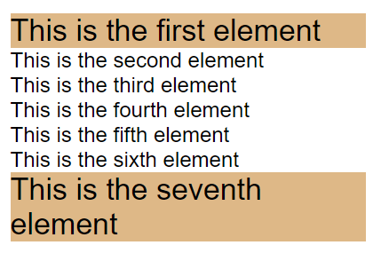

<div className="posts-wrapper">

The most frustrating part for junior front end developers is to figure out the usage of pseudo selectors that they often see like ::_before_, ::_after_, :active and so on. Sometimes we work on huge projects which need optimized CSS for speed meaning, you need efficient selectors to effectively style elements without their ids or classes. This posts therefore, help you to clearly understand CSS selectors.

Before jumping in, please feel free to watch all of my other CSS playlists posts where i have covered most of the trickier concepts (CSS positioning, measurement units, specificity, boxSizing and much more) in CSS. Enough chitchat, let's get started.

# <u>What are pseudo classes ?</u>

Before I give a clear explanation, let's see what MDN says,

<div className="blockquote">

  A CSS pseudo-class is a keyword added to a selector that specifies a special state of the selected element(s). For example, :hover can be used to change a button's color when the user's pointer hovers over it.

  ```css
  {/* Any button over which the user's pointer is hovering  */}

  button:hover {
  color: blue;
  }
  ```
  <br/>

  ### Syntax:

  <br/>

  ```css
  {/* single or double colon */}

  selector:pseudo-class {
  property: value;
  }

  or

  selector::pseudo-class {
  property: value;
  }
  ```

</div>


Let's de-mystify it. 

A pseudo class allows you to style the dynamic states of an element. Like say if you want to target an element where you to style the link while hovering over it. This can only be done via JavaScript by targeting the link and cursor positioning, but that too hard, right? 

That's where pseudo classes comes handy. Just by writing one single line of CSS, one can acheive the above said behavior.

```css
  .link:hover {
    color: blue;
    font-size: 20px;
  }
```

<br/>

For anchor (```<a></a>```) tags, there are many pseudo classes present to display links in different ways. Some of them are listed below:

* ::hover - when user brings cursor over a link

* ::active - when an element is being activated by a user - the time between when a user presses a mouse button and then releases it.

* ::focus  - when an element is able to accept input - the cursor in a input box.

* ::visited - apply styles on a visited link.


# Style the first and last child child elements

These pseudo classes are very much useful when it comes to selecting the first and the last child elements  inside of some other element. So that you can add specific styles to first and last child element.

In the below code snippet, we have a parent div with 7 child paragraph elements provided with basic styles. 

```html
<div class="parent">
  <p>This is the first element</p>
  <p>This is the second element</p>
  <p>This is the third element</p>
  <p>This is the fourth element</p>
  <p>This is the fifth element</p>
  <p>This is the sixth element</p>
  <p>This is the seventh element</p>
</div>
```
<br/>

```css
* {
  margin: 0;
  padding: 0;
}

.parent {
  width: 400px;
  margin: 100px auto;
  height: 100vh;
  font-family: sans-serif;
  font-size: 24px;
}
```
<br/>


Now i am going to change the font size for first and last child elements from 24px to 34px.

```css
p:first-child, 
p:last-child {
  font-size: 34px;
  background-color: burlywood;
}
```

<br/>

### Output:



<br/>

# How nth-of-type() selector can be used

What if you want to change the select the child elements other than first and last. Yes CSS offer that also, with nth-of-type() selector.

```css
{/* select 2nd child element */}
p:nth-of-type(2) {
  font-size: 34px;
  background-color: burlywood;
}
```

<br/>

```css
{/* select odd elements: odd/even */}
p:nth-of-type(odd) {
  font-size: 34px;
  background-color: burlywood;
}
```

<br/>

We can also select the child elements based on formula _(an + b)_ ,where a represents cycle size, n refers to counter (starts at 0) and b is an offset value.

Here, we specify a background color for all p elements whose index is a multiple of 2 with offset 0.

<div className="blockquote">

The 2n+0 has two parts:

* 2n selects every 2nd item

* +0 offsets the start by 0

</div>

<br/>

```css
{/* select based on formula */}
p:nth-of-type(2n+0) {
  font-size: 34px;
  background-color: burlywood;
}
```

<br/>


# Difference between Pseudo-classes and Pseudo-elements

A pseudo-class is a selector that assists in the selection of something that cannot be expressed by a simple selector, for example :hover. A pseudo-element, however, allows us to create items that do not normally exist in the document tree, for example ::after. So you could simply identify a pseudo-class by a single colon (:) and a pseudo-element by two colons (::).

Pseudo-elements include:

# ::before

::before - It inserts something before the content of each selected element(s). For example, inserting text before the content of each ```<p>``` element

```html
<div>
  <p>This is a paragraph</p>
</div>
```

<br/>

```css
p::before {
  content: "Some content ";
  background-color: yellow;
  color: red;
  font-weight: bold;
}
```
<br/>

Output:


<br/>

# ::after

::after - It inserts something after the content of each selected element(s). For example, inserting text after the content of each ```<p>``` element.

```html
<div>
  <p>This is a paragraph</p>
</div>
```

<br/>

```css
p::after {
  content: " Some content";
  background-color: yellow;
  color: red;
  font-weight: bold;
}
```
<br/>

Output:


<br/>

# Conclusion

Hope you guys understood well. Understanding the needs of your project will help you decide the necessity of using pseudo selectors. And that understanding comes from practicing more and more. The CSS pseudo-classes I covered in this article may not be the the perfect selectors for your stylesheets, but they can be invaluable tools, particularly for cases when you can’t rely on id and class selectors. Remember, writing good CSS is about finding the most efficient way to achieve a project’s goals.

Happy coding! :)

</div>