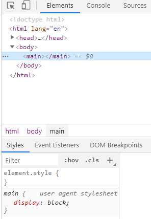
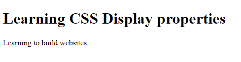
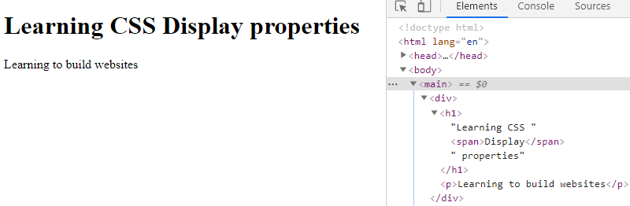
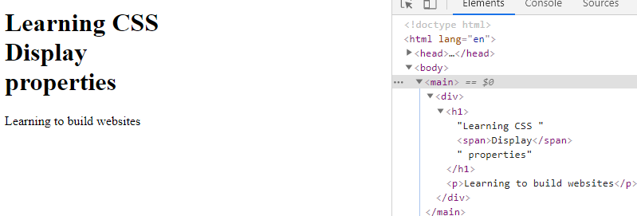

<div className="posts-wrapper">

Every element in a webpage is a box if you look into it carefully. The display property in CSS determines just how that box behaves. 

Let's jump in how display property works under the hood.

# <u>Why we need display property?</u>

The display CSS property sets whether an element is treated as a block or inline element and the layout used for its children. Each and every HTML elements are already been defined the display, however, one can explicitly change their default behavior.

Below code snippet has just a main element defined with no styles. However, in the developer tools, the main element will be displayed as _block_.

```html
<body>
  <main></main>
</body>
```
<br/>

### Developer Console:




### Syntax:

<br/>

```css
span {
  display: block;
}
```

<br/>

# <u>block elements</u>

The block level elements take full width of the page by default. Even there is enough space in a block level element, each element starts in a new line. We can set a block level element width and height properties. 

<div className="blockquote">

Some HTML tags for block level elements:

```<div>, <p>, <h1>, <footer>```

</div>

```html
  <main>
    <div>
      <h1>Learning CSS Display properties</h1>
      <p>Learning to build websites</p>
    </div>
  </main>
```

<br/>



# <u>inline elements</u>

The inline elements are the opposite of block level elements where one can place the elements side by side and takes space as much as they needed. We can't set the width and height properties of inline elements.

<div className="blockquote">

Some HTML tags for inline elements:

```<a>, <span>, , <button>```

</div>

From the above code snippet used for block level elements, i am going to display the "Display" keyword as "inline" element. Let's see what happens.

```html
  <main>
    <div>
      <h1>Learning CSS <span>Display</span> properties</h1>
      <p>Learning to build websites</p>
    </div>
  </main>
```
<br/>

### Developer Console:

<br/>



<br/>

As you can see from the above screenshot, the inline element takes the required space and leaves the rest for others. However, this default property can be changed.

```css
span {
  display: block;
}
```

<br/>



<br/>


# <u>inline-block elements</u>

Compared to inline level elements, the major difference is that display: inline-block allows to set a width and height on the element.

Also, with display: inline-block, the top and bottom margins/paddings are respected, but with display: inline they are not.

Compared to display: block, the major difference is that display: inline-block does not add a line-break after the element, so the element can sit next to other elements.

Let's build a navigation bar using display: inline-block:

```html
<ul class="nav">
  <li><a href="#home">Home</a></li>
  <li><a href="#about">About Us</a></li>
  <li><a href="#services">Our Services</a></li>  
  <li><a href="#contact">Contact Us</a></li>
</ul>
```

<br/>

```css
.nav {
  background-color: yellow; 
  list-style-type: none;
  text-align: center;
  margin: 0;
  padding: 0;
}

.nav li {
  display: inline-block;
  font-size: 20px;
  padding: 20px;
}
```
<br/>

### Developer Console:

<br/>


# Conclusion

Hope you guys understood well. Understanding the needs of your project will help you decide the usage of inline/block level elements in webpage. And that understanding comes from practicing more and more.

Happy coding! :)

</div>