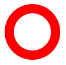
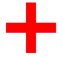
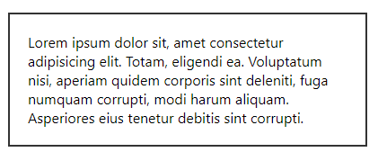
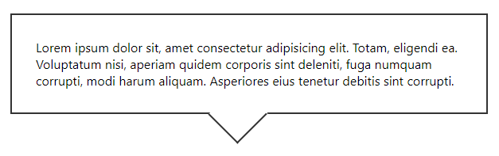

<div className="posts-wrapper">

CSS is capable to creating various shapes and even the shapes that you would have never imagined. As in a daily routine of work, we would be using font awesome icons for various purpose, one of it is for displaying social media icons or icons for services section. Ever thought of creating those in CSS ? In this posts, i will be creating some icons with just CSS.

<div className="blockquote">
The less you raise third party requests, the faster will be the website performance.
</div>

Below are the shapes that we are going to create using CSS. I will try my best to make the explanation simple and also the code.

{/* display the image */}

# Search Icon

For search icon, we will be splitting the icon into two sections. First will be the circle and then the handle like shape. We don't need two separate div's to create so, where we can use the CSS Pseudo Elements such as ::before & ::after. We have explained the concept of pseudo elements in our previous posts for better understanding.

<div className="post-recommendation">

<span className="previous-post">You might also like: </span><a href="https://www.javascriptwillrule.com/css-pseudo-selectors-explained" target="_blank" aria-label="pwa explained blog post link"> CSS PseudoClasses - What are Pseudo classes and why to use it ?</a>

</div>
<br/>

### Create circle with width, height and border radius

<br/>

```css
#search-icon {
  display: inline-block;
  width: 4rem;
  box-sizing: content-box;
  height: 4rem;
  border: 1rem solid red;
  position: relative;
  border-radius: 3.5rem;
}
```
<br/>



<br/>

The reason why i have added display:inline-block is that we are going to display the search icon inside the navbar, so it should not be made _display: block_ as it takes up full width and will not allow any elements to seat next to them.

<div className="post-recommendation">

<span className="previous-post">You might also like: </span><a href="https://www.javascriptwillrule.com/css-inline-inlineblock-block-display-property" target="_blank" aria-label="pwa explained blog post link"> CSS Display Property - Block Vs Inline-Block Vs Inline Elements</a>

</div>
<br/>

### Add ::after selector to create search icon handle part

<br/>

```css
#search-icon:after {
  content: "";
  display: inline-block;
  position: absolute;
  right: -2.5rem;
  bottom: -1rem;
  border-width: 0;
  background: red;
  width: 3.5rem;
  height: 1rem;
  transform: rotate(45deg);
}
```

<br/>


<br/>

To create this handle section, the most important property is to give the ::after pseudo selector positioning value as absolute, as the parent #search-icon is relatively positioned. And adjust the right bottom values to correctly position the handle. 

<hr/>

<br/>

# Plus icon

This is fairly simple if you understood the previous one. Without looking onto the source code below, try it yourself and compare it with my code.

```css
#plus-icon {
  background: red;
  height: 100px;
  position: relative;
  width: 20px;
  left: 100px;
}

#plus-icon:after {
  background: red;
  content: "";
  height: 20px;
  left: -40px;
  position: absolute;
  top: 40px;
  width: 100px;
}
```

<br/>



<br/>

<hr/>

<br/>

# Moon

```css
#moon {
  height: 200px;
  width: 200px;
  background-color: transparent;
  box-shadow: -20px 20px 0 15px #fff;
  border-radius: 50%;
}
```

<br/>


<br/>

<hr/>

<br/>


# Heart

```css
#heart {
  position: absolute;
}

#heart::before,
#heart::after {
  background-color: #cb231c;
  border-radius: 50px 50px 0 0;
  height: 75px;
  width: 50px;
  content: '';
  position: absolute;
  /* now rotate */
  transform: rotate(-45deg);
  transform-origin: 0 100%;
  left: 50px;
}

/* now design the other side */
#heart::after {
  transform: rotate(45deg);
  left: 0;
  transform-origin: 100% 100%;
}
```

<br/>


<br/>

<hr/>

<br/>

# Outlined Div Boxes with Arrows

```html
<div id="container">
  Lorem ipsum dolor sit, amet consectetur adipisicing elit. Totam, eligendi ea. Voluptatum nisi, aperiam quidem corporis sint deleniti, fuga numquam corrupti, modi harum aliquam. Asperiores eius tenetur debitis sint corrupti.
</div>
```

<br/>

```css
#container {
  position: relative;
  max-width: 400px;
  height: auto;
  border: 2px solid #333;
  margin: 100px auto;
  padding: 20px;
  box-sizing: border-box;
}
```

<br/>



<br/>

```css
#container:after {
  content: '';
  position: absolute;
  width: 50px;
  height: 50px;
  border-top: 2px solid #fff;
  border-right: 2px solid #333;
  border-bottom: 2px solid #333;
  border-left: 0px solid #fff;
  top: 100%;
  left: 50%;
  margin-left: -40px;
  transform: rotate(45deg);
  margin-top: -25px;
  background: #fff;
}
```

<br/>



<br/>

<hr/>

<br/>

</div>