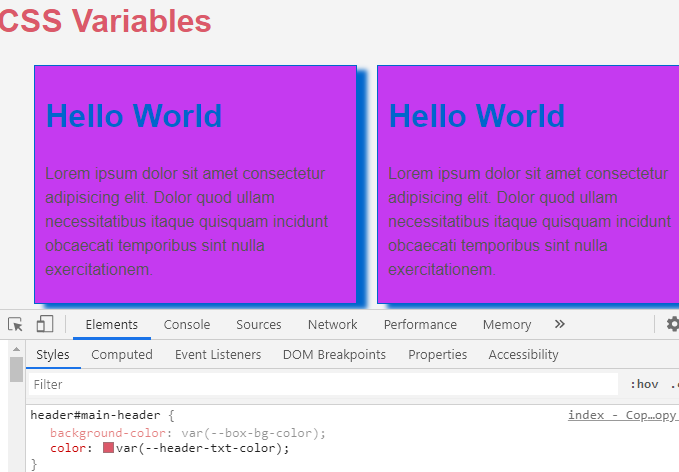

<div className="posts-wrapper">

Hi Guys, in this posts we are going to look at CSS variables aka CSS Custom properties. Normally for using variables inside CSS, we will be using SASS/LESS preprocessors to handle dynamic values/variables in our CSS. But now we can do it natively.

So most of you guys would be thinking like, "So is there any need of SASS hereafter". Nope not like that. SASS offers many more features out of the box like mixins, looping, nesting and much more unlike CSS native functionality. If you don't have any need of using SASS, just don't use it. Go with CSS because its native, you don't have to compile and you can access it through JavaScript.

Regarding Browser support, CSS variables are compatible with all modern browsers except IE. People using Internet Explorer has to suffer, however with SASS variables will be compiled down to regular CSS, so you don't have to worry about that.

It's upto you to consider using CSS variables in your project or going with pre-processors. Anyway getting knowing things is not bad. So let's get started.

I have created 2 files, index.html with some markup and styles.css empty.

### _In index.html:_

<br/>

Simple markup, just a header and 2 boxes where we will learn on how to apply the styles using CSS variables by declaring those in global and local scopes.

<br/>

```html
<header id="main-header">
  <h1>CSS Variables</h1>
</header>

<div class="container">
  <div class="grid">
    <div class="box">
      <h1>Hello World</h1>
      <p>Lorem ipsum dolor sit amet consectetur adipisicing elit. Dolor quod ullam necessitatibus itaque quisquam incidunt obcaecati temporibus sint nulla exercitationem.</p>
    </div>
    <div class="box">
      <h1>Hello World</h1>
      <p>Lorem ipsum dolor sit amet consectetur adipisicing elit. Dolor quod ullam necessitatibus itaque quisquam incidunt obcaecati temporibus sint nulla exercitationem.</p>
    </div>
  </div>
</div>
```

<br/>

### _In styles.css:_

<br/>

In CSS, to define variables we have some syntax to be followed and also there are some rules like where the variables are to be declared. We define variables inside root element with the syntax as like below:

```css
:root {
  {/* set background color */}
  --bg-color: #f5f5f5;
}

body {
  background-color: var(--bg-color);
}
```

So instead of just showing the syntax, i will create a section where we will be using CSS Grid to align the boxes and access their color/font/background properties that we declare through variables using JavaScript.

### In _styles.css:_

<br/>

So we have declared the backgroundColor/font color/width and some more using CSS variables. Now we will use the same in body element.

<br/>

```css
:root {
  --main-bg-color: #f4f4f4;
  --main-txt-color: #333;
  --container-width: 90%;
  --header-bg-color: #333;
  --header-txt-color: rgb(219, 89, 106);
}

body {
  margin: 0;
  padding: 0;
  line-height: 1.5;
  font-family: Arial, Helvetica, sans-serif;
  background-color: var(--main-bg-color);
  color: var(--main-txt-color);
}
```

<br/>

Now we will set the container the width using declared CSS variable (--container-width) and background color/font color for the header section.

```css
.container {
  width: var(--container-width);
  margin: 20px auto;
}

header#main-header {
  background-color: var(--header-bg-color);
  color: var(--header-txt-color);
}

header#main-header h1 {
  padding: 0;
  margin: 0;
}
```

<br/>

## Is CSS variables always global scope ?

<br/>

A big NOPE !! We can define variables for a particular section i.e.., in local scope. In below example, we will define some vars for box section and try to access it in upper container.

```css
.box {
  --box-bg-color: orange;
  --box-main-color: #06c;
  --box-padding: 5px 10px;
}
```

Now the color of the header section is --header-bg-color (black), which we will try to change it by adding the variable --box-bg-color (orange), which is local scoped.

```css
header#main-header {
  background-color: var(--box-bg-color);
  color: var(--header-txt-color);
}
```

<br/>

### Output Console:

<br/>

As you can see in the below image on developer tools, the background color property is greyed out, as the scope checking fails and hence the orange background for header failed to apply.

<br/>



<br/>

This is how the local scoping of CSS variables work.


</div>