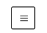

<div className="posts-wrapper">

Okay, So far we have learned basic CSS Concepts, now we will try to apply those principles in our project by building responsive navigation menu using HTML & CSS.
Also we are going to learn 2 new HTML tags which you guys would have not heard of.

Before heading into the tutorial part, this is what we are going to build:

<br/>

[](https://gifyu.com/image/u1vZ)

Let's get started.

## Step 1: Semantic HTML elements

<br/>

```html
<details>
  <summary></summary>
  <nav class="menu">
    <a href="#">Home</a>
    <a href="#">Work</a>
    <a href="#">Links</a>
    <a href="#">Contact</a>
    <a href="#">About</a>
  </nav>
</details>
```

<br/>

```css
:root {
  --primColor: #dcdcdc;
  --secoColor: #555555;
  --cornerRad: 4px;
}

body {
  background-color: var(--primColor);
  font-family: Arial, Helvetica, sans-serif;
  font-size: 20px;
}
```

<br/>

Just decorating the body section.

## Step 2: What details and summary tags will do ?

<br/>

Just like accordians. The child elements of ```<details>``` tag will be considered as the content and the summary tag will be the accordian header. Without using any CSS/JavaScript we can create an accordian in HTML itself. Glad I learned this.

So far:

[](https://gifyu.com/image/u1DL)

## Step 3: Decorate the icon

<br/>

```css
summary {

  text-align: center;
  padding: 12px 10px;
  width: 23px;
  height: 17px;
  background-color: var(--primColor);
  border: 2px solid var(--secoColor);
  border-radius: var(--cornerRad);
  color: var(--secoColor);
  cursor: pointer;
  user-select: none;
  outline: none;
  transition: transform 200ms ease-in-out 0s;
}

summary::before,
summary::after {
  position: static;
  top: 0;
  left: 0;
}
summary::before {
  content: "";
}
summary::after {
  content: "III";
  letter-spacing: -1px;
}

summary:hover {
  transform: scale(1.1);
}

{/* to hide the arrow icon */}

summary::-webkit-details-marker {
  display: none;
}

{/* Add this property to summary section to transform the "III" to horizontal position */}

summary {
  writing-mode: vertical-lr;
}
```

<br/>

So far:



<br/>

## Step 4: Transform ham menu to cross symbol

<br/>

```css
{/* add the X on open */}
details[open] summary::before {
  content: "X";
}
{/* remove the ham menu that we added in summary::after */}
details[open] summary::after {
  content: "";
}
```

<br/>

So far:

[](https://gifyu.com/image/u11g)

<br/>

## Step 5: Styling the nav and links

<br/>

```css
.menu {
  width: fit-content;
  border-radius: var(--cornerRad);
  background-color: var(--primColor);
  box-shadow: 0 4px 12px 0 rgba(0, 0, 0, 0.2);
  margin-top: 8px;
  display: flex;
  flex-direction: column;
  justify-content: space-between;
  overflow: hidden;
}

.menu a {
  padding: 12px 24px;
  margin: 0 16px;
  color: var(--secoColor);
  border-bottom: 2px solid rgba(0, 0, 0, 0.1);
  text-decoration: none;
  text-align: center;
  transition: filter 200ms linear 0s;
}

{/* padding top for 1st link */}

.menu a:nth-of-type(1) {
  padding-top: 24px;
}

{/* link hover */}

.menu a:hover {
  filter: brightness(200%);
}
```

<br/>

So far:

[](https://gifyu.com/image/uATF)

<br/>

## Step 6: Add helper content and hide on menu open

<br/>

```css
details::before {
  content: "← Click This Button";
  color: var(--secoColor);
  position: absolute;
  margin-left: 80px;
  padding: 10px 10px;
  opacity: 0.4;
}

details[open]::before {
  animation: fadeMe 300ms linear forwards;
}

@keyframes fadeMe {
  0% {
    opacity: 0.4;
  }
  100% {
    opacity: 0;
  }
}
```

<br/>

[](https://gifyu.com/image/u1vZ)

</div>