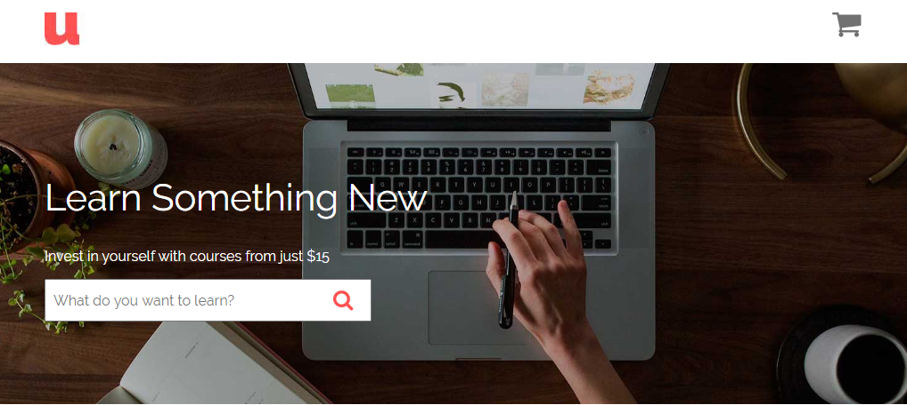
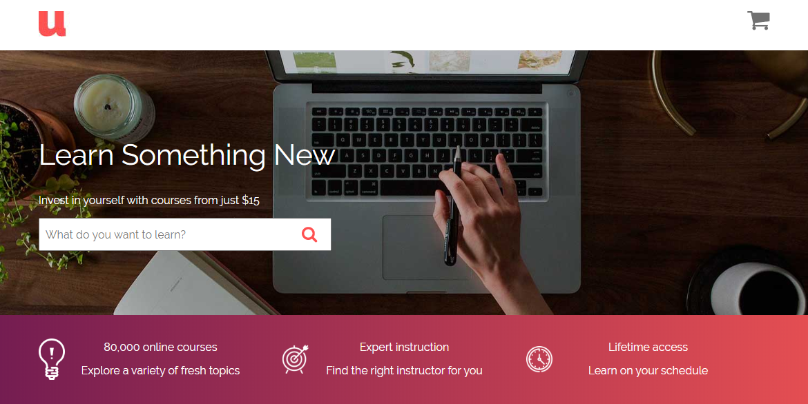
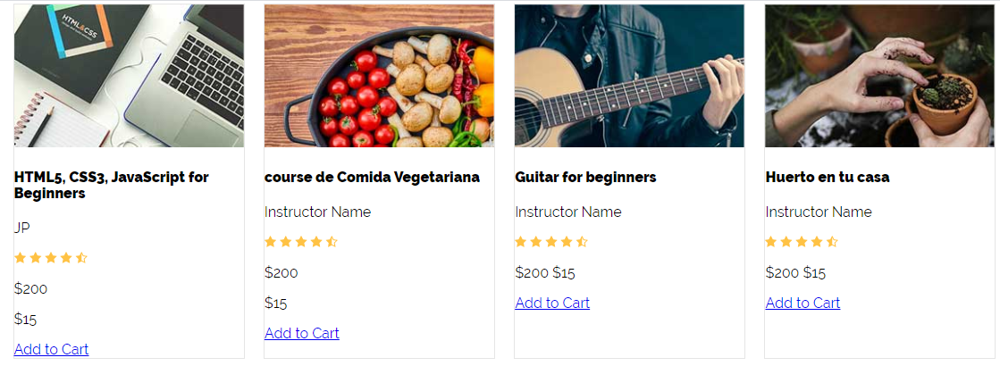
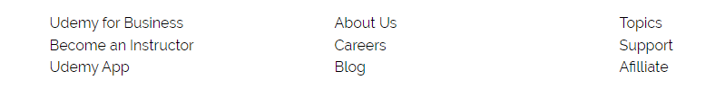

<div className="posts-wrapper">

  Learning through the syntax and flexbox properties won't help you in the long run if you're not practising it by building real world applications. So, in this project we will learn the basics of flexbox by building the homepage of the Udemy website.
  Let's get started.

  The udemy clone page that we are going to build:

  https://subinedge.github.io/Udemy_Home_page

  The github code:

  https://github.com/subinedge/Udemy_Home_page

  ## Step 1: Header Menu - Placing the logo and cart icon

  <br/>

  Index.html:

  In the header container, we are displaying logo and cart image, which on hover shows the course information like name of the course, price and the thumbnail with button to clear the cart (We are not focusing on the javascript part here, that i'll do in a separate posts). I am placing image, course name, price using HTML tables.

  ```html
  <header id="header" class="header container">
    <div class="logo">
      
    </div>
    <div class="cart-content">
      
      <div class="content hidden">
        <table id="cart-list">
          <thead>
            <tr>
              <th>Image</th>
              <th>Name</th>
              <th>Price</th>
            </tr>
          </thead>
          <tbody>
            <tr>
              <td>
                
              </td>
              <td>CSS Grid & Flexbox - The Ultimite Guide +10 Projects</td>
              <td>$15</td>
            </tr>
          </tbody>
        </table>
        <a href="#" class="button">Clear Cart</a>
      </div>
    </div>
  </header>
  ```

  <br/>

  Styles.scss

  We are using Sassy CSS, where we will be using mixins, variables, nesting and much more. Setting up the max-width of the container and centering it with ```margin: 0 auto;``` property. Use ```display:flex;``` to make the logo and the cart icon in horizontal position and to space out the logo and cart icon, use ```justify-content:space-between;``` property with some breathing space (padding) to elements.

  ```scss
  *,
  *:after,
  *:before {
    box-sizing: border-box;
  }

  body {
    font-family: "Raleway", sans-serif;
  }

  .container {
    max-width: 1100px;
    width: 90%;
    margin: 0 auto;
  }

  .header {
    display: flex;
    justify-content: space-between;
    padding: 1rem 0;
  }
  ```


  <br/>

  And we will add the hover logic for cart icon, where on user hovering over the cart icon, the course details will be visible. To position the course details under the cart icon, displaying the parent of the cart section as relative and the content section as absolute would do the trick.

  ```css
  .hidden {
    display: none;
  }

  .cart-content {
    position: relative;

    &:hover .content {
      position: absolute;
      display: block;
      right: 0; // stick the section to atmost right
      max-width: 400px;
    }
  }
  ```

  <br/>

  ## Step 2: Header Menu - Building Mixin for buttons

  <br/>

  As you can see from the finished project, there are two types of buttons with change in the backgroundColor. One in the clear cart and another one in the course list. So, we are going to use mixins for that to minimize the code we write.

  ```scss
  $secondary: #741d51;

  @mixin button($background-color) {
    background-color: $background-color;
    padding: 0.5rem 1rem;
    display: block;
    text-align: center;
    color: #fff;
    text-decoration: none;
  }

  .cart-content {
    .button {
      @include button($secondary);
    }
  }
  ```

  <br/>

  So far:

  [](https://gifyu.com/image/QMLV)

  <br/>

  ## Step 3: Hero Image - Laying out hero image and headings

  <br/>

  Index.html

  ```html
  <div class="hero">
      <div class="hero-content container">
        <h2>Learn Something New</h2>
        <p>Invest in yourself with courses from just $15</p>
        <form action="#" method="post">
          <input type="text" placeholder="What do you want to learn?" />
          <input type="submit" class="submit" />
        </form>
      </div>
    </div>
  ```

  <br/>

  So, as you can see in the HTML, we have two divs: hero and hero-content. We are going to start working with hero where we will be adding background image and making hero display property as flex to align items center vertically.

  ```scss
  .hero {
    background-image: url(../img/hero.jpg);
    background-size: cover;
    background-position: center center;
    min-height: 24rem;
    display: flex;
    align-items: center;
  }
  ```

  <br/>

  So, the image part is completed, next is positioning the headings and input form.

  ```scss
  .hero-content {
    color: #fff;
    h2 {
      font-size: 2.6rem;
      font-weight: 400;
    }
    form {
      position: relative;

      input[type="text"] {
        width: 100%;
        height: 3rem;
        padding-left: 0.5rem;
      }

      input[type="submit"] {
        position: absolute;
        top: 0;
        right: 0;
        display: block;
        text-indent: -9999px;
        background-color: transparent;
        border: none;
        width: 3rem;
        height: 3rem;
        background-image: url(../img/search.png);
        background-repeat: no-repeat;
        background-position: center center;
      }
    }
  }
  ```

  <br/>

  ## Step 4: Input form - Building mixins for media queries

  <br/>

  To make input form responsive, we will be adding media queries through mixins.

  ```scss
  {/* mixins */}

  @mixin phone {
    @media (min-width: 480px) {
      @content;
    }
  }

  @mixin tablet {
    @media (min-width: 768px) {
      @content;
    }
  }

  @mixin desktop {
    @media (min-width: 1000px) {
      @content;
    }
  }

  {/* include in form container */}
  @include tablet {
    width: 40%;
  }
  ```

  <br/>

  Some of you might be confused on why we add @content inside mixins. @content will read your content, where you will be using that specific mixin. In our example i have used it inside form container with @include.

  So far:

  

  ## Step 5: Working with main features section

  <br/>

  In the finished project, you can see the section underneath the hero section, which we will be bulding now. The features it includes is laying out in columns and making it responsive. Also, it is having linear gradient color as a background color, where we will be using mixins for adding gradients.

  Index.html:

  ```html
  <div class="bar">
      <div class="icons container">
        <div class="icon icon1">
          <p>80,000 online courses</p>
          <p></p>
          <p>Explore a variety of fresh topics</p>
        </div>
        <div class="icon icon2">
          <p>Expert instruction</p>
          <p>Find the right instructor for you</p>
        </div>
        <div class="icon icon3">
          <p>Lifetime access</p>
          <p>Learn on your schedule</p>
        </div>
      </div>
    </div>
  ```

  <br/>

  In stylesheet, we will specify the height and color of the container and elements. Using mixins we will pass the two colors to get the gradient look in the background.

  ```scss
  $secondary: #741d51;
  $alternative: #e44e52;

  {/* mixins for gradient */}

  @mixin gradient($color1, $color2) {
    background: linear-gradient(to right, $color1 0%, $color2 100%);
  }
  
  .bar {
    min-height: 5rem;
    background: $secondary;
    color: #fff;
    @include gradient($secondary, $alternative);
  }
  ```

  <br/>

  Next part is to lay out the columns using flexbox and adding media query mixins for responsiveness. To space out 3 columns evenly in desktop mode, we add flex property as 1, which will make all flexible items be the same length, regardless of its content.

  ```scss
  .bar {
    .icons {
      display: flex;
      flex-direction: column;

      @include desktop {
        flex-direction: row;
      }

      .icon {
        @include desktop {
          flex: 1;
        }
      }
    }
  }
  ```

  Add icons for the 3 sections through mixin.

  ```scss
  @mixin bg-icon($image) {
    background-repeat: no-repeat;
    background-position: left center;
    text-align: center;
    background-size: 2.4rem;
    background-image: url(../img/#{$image}.png);
  }

  .icons{
    padding: 1.4rem 0;

    .icon {
      &.icon1 {
        @include bg-icon(icon1);
      }

      &.icon2 {
        @include bg-icon(icon2);
      }

      &.icon3 {
        @include bg-icon(icon3);
      }
    }
  }
  ```

  <br/>

  So far:

  

  <br/>

  ## Step 6: Building the course list section

  <br/>

  Now we have come to the most important part of the webpage, the course list section.

  Index.html

  ```html
  <div class="course-list container">
    <div class="course">
      
      <div class="course-info">
        <h4>HTML5, CSS3, JavaScript for Beginners</h4>
        <p>JP</p>
        
        <div class="price">
          <p class="regular">$200</p>
          <p class="offer">$15</p>
        </div>
        <a href="#" class="button">Add to Cart</a>
      </div>
    </div>

    ......

    {/* like this 11 other course items added */}

  </div>
  ```

  <br/>

  So, you can see course list at the top which will act as a flex container.

  ```scss
  .course-list {
    margin-top: 5rem;
    display: flex;
    flex-wrap: wrap;
    justify-content: space-between;

    {/* now we have common target for each course, to determine width based on device size */}

    .course {
      flex: 0 0 calc(50% - 1rem); 

      @include tablet {
        flex: 0 0 calc(33.3% - 1rem);
      }
      @include desktop {
        flex: 0 0 calc(25% - 1rem);
      }

      background-color: #fff;
      margin-bottom: 1rem;
      border: 1px solid darken($gray, 5%);
    }
  }
  ```

  <br/>

  So far:

  

  <br/>

  ## Step 7: Styling content inside each course

  <br/>

  ```scss
  .course-info {
    padding: 1rem;
    h4 {
      margin: 0;
      font-size: 1.2rem;
    }

    .price {
      display: flex;
      justify-content: space-between;

      .regular {
        text-decoration: line-through;
      }

      .offer {
        font-size: 1.4rem;
        font-weight: 700;
      }
    }

    .button {
      @include button($primary);
    }
  }
  ```

  <br/>

  ## Step 8: Footer Section - Finishing the project

  <br/>

  Finally we have arrived at the footer section. We are not going to do any fancy thing in this section. Just a menu list will be displayed into three columns.

  ```html
  <footer id="footer" class="footer">
      <div class="container">
        <div class="container-footer">
          <nav class="menu">
            <a class="link" href="#">Udemy for Business</a>
            <a class="link" href="#">Become an Instructor</a>
            <a class="link" href="#">Udemy App</a>
          </nav>
          <nav class="menu">
            <a class="link" href="#">About Us</a>
            <a class="link" href="#">Careers</a>
            <a class="link" href="#">Blog</a>
          </nav>
          <nav class="menu">
            <a class="link" href="#">Topics</a>
            <a class="link" href="#">Support</a>
            <a class="link" href="#">Afilliate</a>
          </nav>
        </div>
      </div>
    </footer>
  ```

  <br/>

  ```scss
  .container-footer {
    display: flex;
    flex-direction: column;

    @include tablet {
      flex-direction: row;
    }

    .menu {
      display: flex;
      flex-direction: column;
      margin-bottom: 1rem;
      flex: 1;
      @include desktop {
        flex: 0 0 calc(30% - 1rem);
      }
      a {
        color: $black;
        text-decoration: none;
        margin-bottom: 0.4rem;
        text-align: center;
        @include desktop {
          text-align: left;
        }
      }
    }
  }
  ```

  <br/>

  Completed footer section:

  

  The final result:

  https://subinedge.github.io/Udemy_Home_page

</div> 