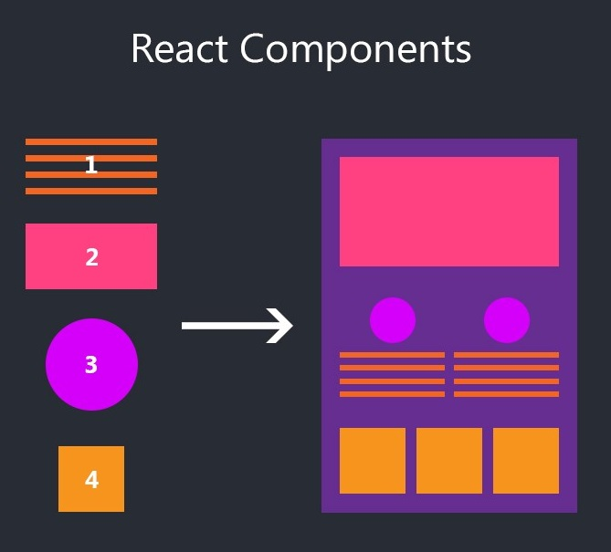
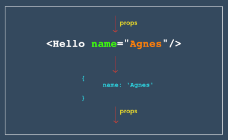

<div className="posts-wrapper">

We are here into new playlists - ReactJS. Like CSS, we will cover every important/intriguing concepts in reactjs by building real world applications. But before going into the coding part, it would be great and helpful if we try to understand the uniqueness/features provided by REACT over other competitors like Vue and Angular.

1. What are components and types of components.

2. Difference between states and props.

3. What is Virtual DOM and how it's different from Real DOM ?

<hr />

<br />

## What are components and types of components

<br />

In olden days of programming, the code will be written in a single JS file with thousand and thousands of lines of code which will be hard to read/maintain if any issue arises in future or if the client needs an upgrade. So, facebook decided to introduce the component concept into the world with REACT library.

Basically, components are small pieces of code in a JS file. Every single section of webpage is considered as a component and can be reused, so that if you find any issue in particular section, say in Navbar, we can look into that single component alone rather looking into the 1000 lines of JS code in one single file.



Above image would be an easy way to summarize the usage of components. The image has a typical webpage like layout where it has a hero section with services section displayed in 2 columns and three blog posts listed at the bottom. Without using React we would be writing the HTML for all the 2 services section and 3 blog posts which doesn’t follow DRY principle.

By using Component concept, we can write one services section, for instance, in `services.js` and reuse it in second column by just declaring the component name, which will save time and easy to maintain.

### But how will you differentiate the two components ?

<br />

The differentiation can be acheived by using props (which are similar to parameters in functions) in component declaration.

For example:



<br />

In the above image, "Hello" is the component name and the name property is the props that we are passing to the hello component.

<div className="blockquote">
  If the value is dynamic we can use props. If the values will be changing based
  on events triggered, then we will be using State which we will discuss in
  later section.
</div>

In the same way, we can create one blog post and reuse it multiple times with passing props for making it different.

<br />

### Types of components

<br />

1. Functional Components / Stateless Components

Functional components are stateless components where we can't use states, which means there is no logic involved in functional component file. They are also called as dump components. But facebook recommends using functional components unless there is a logic portion to be inserted. Later facebook revealed the mystery recipe called REACT HOOKS which is a gamechanger in component architecture where we can write logics in functional components itself. We will be covering HOOKS later, not soon.

Syntax:

```jsx
{
  /* Hello.js */
}
const Hello = props => {
  return <h1>Hello {props.name}</h1>
}

export default Hello
```

<br />

2. Class Components / Stateful Components

Class components are stateful components where we can use state to trigger dynamic value based on event trigger. For example, in this blog site, i have used state in the homepage newsletter section, where when the user clicks the subscribe button, the email validation will occur and change the text above from "Get my weekly posts to your mail" to "Thanks for subscribing". This is one of the example for using state in class components. Also, i have used state in navbar toggling in mobile device.

Syntax:

```jsx
{/* Newsletter.js */}
class Newsletter extends React.Component {

  {/* initial state */}
  this.state = {
    email: "",
    message: "Get my weekly posts to your mail",
  }

  ......

  {/* this is how you change the state */}
  this.setState({ message: "Thanks for subscribing !" })

  render() {
    return (
      <input
            type="email"
            value={this.state.email}
            onChange={this.changeEmailHandler}
            required
            placeholder="Email address"
          />
    )
  }
}

export default Newsletter
```

<br />
<hr />
<br />

## Difference between states and props

<br />

If the above explanation on types of components is understood, then it would be easy for you to guess the differences in states and props.

### State

<br/>

States are used in class components which is defined as an object with a set of properties that control the behavior of the component. Based on the user events trigger, we can change the content/behavior of the specific element. Hence, we can say that states are mutable. But there is a condition on updating the state in react. 

<div className="blockquote">
You have to use setState for updating state.
</div>

THIS IS NOT CORRECT !!!

```jsx
this.state = {
  message: "Get my weekly posts to your mail",
}

this.state.message = "Thanks for subscribing !"
```

<br />

THIS IS CORRECT !!!

```jsx

this.state = {
message: "Get my weekly posts to your mail",
}

this.setState({ message: "Thanks for subscribing !" })
```

<br/>

### Props

<br/>

In the other hand, props are also called as properties which is used for transmitting data from one component to another. As said in above example on adding multiple blog posts in a section, we will use one component and reuse it wherever required. To differentiate the 3 blog posts, like the posts heading, the excerpt, we will pass the values as props.

As I said the props are used for data transmission from one component to another, I didn't mention one more restriction that props has. 

<div className="blockquote">
Data with props should be passed in a uni-directional flow (one way from parent to child).
</div>

Props are immutable, which means that data coming from the parent should not be changed by child components.

Now we will have an example on how to use props.

Parent Component (Class Component):

```jsx
class ParentComponent extends Component {  
  render() {
    return (
      <h1>
        I am the parent component.
        <ChildComponent />
        <ChildComponent />
        <ChildComponent />
      </h1>
    );
  }
}
```

<br/>

Child Component(Functional Component):

```jsx
const ChildComponent = () => {  
  return <p>I'm the 1st child!</p>; 
};
```

<br/>

The above will execute Child component three times with same message "I'm the 1st child!". To make it dynamic, we have to pass props.

```jsx
{/* parent component */}
<ChildComponent childCount="1st"/>
<ChildComponent childCount="2nd"/>
<ChildComponent childCount="3rd"/>
```

<br/>

```jsx
const ChildComponent = (props) => {  
  return <p>I'm the {props.childCount} child!</p>; 
};
```

<br/>

<hr/>

<br/>

## What is Virtual DOM and how it's different from Real DOM ?

<br/>

Before getting into virtual DOM, let's first see what Document object model (DOM) means. 

DOM, which means Document Object Model represents the heirarchy of the webpage in a tree like structure. In simple words, it shows the HTML tags or elements used in creating a webpage. Ultimately, any language you use, it finally parsed into HTML webpage by HTML parser. Below is the sample DOM structure.


The main disadvantage in DOM is the update process. If there any DOM manipulation is made (say, removing text in paragraph tag in JS), the DOM will parse the HTML and removes the child element of that specific ID mentioned. Then DOM will updates it with new content. It won't stop there, it will re-render/re-calculate the CSS for the parent and child elements where updation was made and updates the layout. Finally, the DOM tree is built with updated values and painted in browser.
There are this many processes to be followed for just a single word update. Imagine, how much time it will take if it is done 10times. For every times, the above process has to be executed.

<div className="blockquote">
This is why in the olden days, its said that, don't overdo DOM manipulation, which is why everyone is ditching JQuery.
</div>

REACT never cares and overcomes these obstacles by introducing VIRTUAL DOM, which is a lightweight copy of REAL DOM. It is a same as REAL DOM but it never outputs the updates directly on the screen. Manipulating the Virtual DOM is faster as it is not painting anything onto the screen.

There are process that Virtual DOM follows while DOM manipulation is made:

Before VIRTUAL DOM is updating its structure, it takes a snapshot of current tree structure and when it gets updated it compares updated Virtual DOM with previous state Virtual DOM. ReactJS using diff algorithm compares both the Virtual DOM to find the minimum number of steps to update the Real DOM. Once REACT knows which objects are changed in the VIRTUAL DOM, it sends the updated objects to REAL DOM for painting on the browser.

### Batch update

<br/>

Once REACT compares and finds out the changes in the virtual DOM, it won't send each and every change individually to REAL DOM, instead it sends in batch mode. This means during the update process, there is exactly one time when the Real DOM is being painted. Thus all the update process will run only one time for updating the real DOM.

<br/>

<hr/>

<br/>

Hope I have covered all the basic concepts that REACT NEWBIE must understand before jumping into REACT world. See you in next posts of REACT.

</div>
