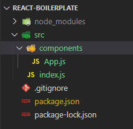
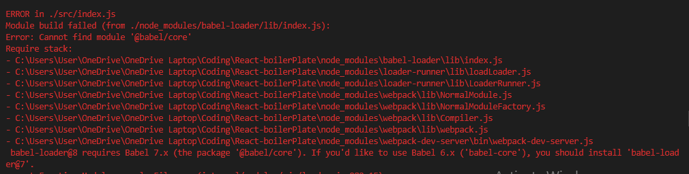
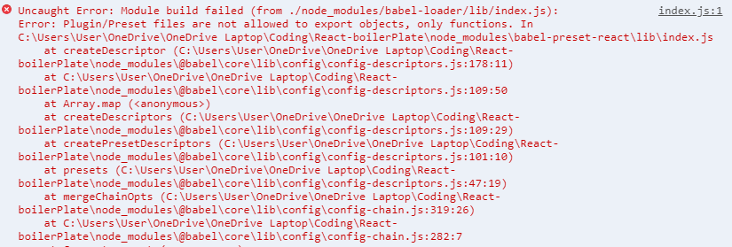
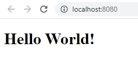
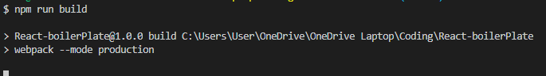
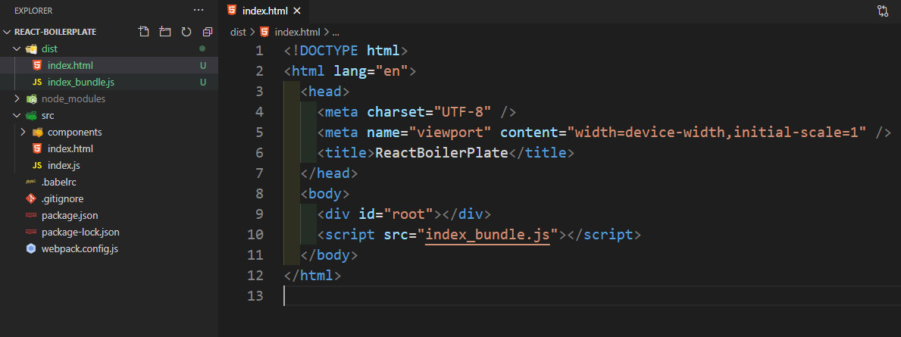

<div className="posts-wrapper">

The easiest way to start practicing React is through Create React App (CRA). But we are choosing the hard path. In this posts, we will learn how to setup React workflow without create react app, so that we will be knowing what's happening under the hood.

At the end of this posts, you should be able to understand how Babel and Webpack fit into this ecosystem.

In the previous posts, we learned about the basic concepts that one need to know before jumping into React. Have a look at the previous post, so that it would be easier to grasp the React basics for newbies.

<div className="post-recommendation">

  <span className="previous-post">Check it out: </span><a href="http://localhost:8000/reactjs-intro-tutorial-with-no-existing-react-knowledge" target="_blank" aria-label="reactjs getting started guide"> REACT JS Concepts - This Tutorial Doesn’t Assume Any React Knowledge.</a>

</div>

## Steps involved in setting up React from scratch

<br/>

1) Initializing npm and creating ___package.json___ file

2) Install React library

3) Example React code for analyzing the plugins needed

4) Installing webpack and babel packages

5) Creating ___webpack.config.js___ file for bundling components

6) Add babel transpiling ES6 features in webpack config file

7) Adding htmlWebpackPlugin to create index.html for direct deploy

8) Declaring babel-presets .babelrc file

9) Creating a simple Hello world application to test the setup

10) Issues faced on setup

<br/>

Complete React BoilerPlate Github Code:

https://github.com/subinedge/ReactJS-Boiler-Plate

Let's get started.

## Step 1: Initializing npm and creating ___package.json___ file

<br/>

First, we will create a package.json file to manage the production and dev dependencies.

```cmd
npm init -y
```

<br/>

-y flag denotes a brand new package.json file has to be created with all the default values/configurations filled. This is how it looks like after initializing is done.

```json
{
  "name": "React-boilerPlate",
  "version": "1.0.0",
  "description": "",
  "main": "index.js",
  "scripts": {
    "test": "echo \"Error: no test specified\" && exit 1"
  },
  "keywords": [],
  "author": "",
  "license": "ISC"
}
```

<br/>

## Step 2: Install React and ReactDOM

<br/>

There are two packages from the NPM directory that we want to install. REACT and ReactDOM. Prior to v0.14, all ReactDOM functionality was part of React. As the name implies, ReactDOM is the glue between React and the DOM. Often, you will only use it for one single thing: mounting with ___ReactDOM.render()___. For everything else, there's React. You use React to define and create your elements, for lifecycle hooks, etc. i.e. the guts of a React application.

```cmd
npm install react react-dom
```

<br/>

On successfully executing the above command, package.json will be getting updated with react and ReactDOM packages and also node_modules folder will be generated. Node modules contains the dependencies that react and reactDOM has. On further installing more and more packages from NPM, the node_modules folder will get bigger and bigger. Hence, it's advisable not to push the node_modules folder to Github as it will take too much time for uploading and also complete nightmare for the other person who will be downloading the code. Add the node_modules in ___.gitignore___ file.

Below entries will be added to package.json file.

```json
"dependencies": {
  "react": "^16.13.1",
  "react-dom": "^16.13.1"
}
```

<br/>

## Step 3: Example React code for analyzing the plugins needed

<br/>

We will create ___index.js___ file inside the src folder. We will make index.js file as the central integration file where all main component(App.js) will get declared and the mounting to DOM happens. So, by this time you have guessed the packages that will be present in the import statement. REACT and REACTDOM. We will create one component(App.js) and integrate it with index.js file.

Folder structure so far:



<br/>

index.js:

```javascript
import React from "react";
import ReactDOM from "react-dom";
import App from "./components/App";

ReactDOM.render(<App />, document.getElementById("root"));
```

<br/>

components/App.js:

```javascript
import React, { Component } from "react";

export default class App extends Component {
  render() {
    return (
      <div>
        <h1>Hello World!</h1>
      </div>
    );
  }
}
```

<br/>

So in the above codes you might have noticed the ES6 syntax that is followed and JSX syntax that React follows. These has to be transpiled to browser compatible versions. This is where Babel comes into picture, which is the best tool for transpiling future JavaScript syntax to browser compatible JavaScript.

### Babel packages needed:

<br/>

* babel-preset-env --> responsible for transpiling from ES6 to ES5

* babel-preset-react --> responsible for converting React JSX syntax to JavaScript syntax

* babel-loader & babel-core --> responsible for talking to Babel


### Webpack packages needed:

<br/>

Not only the transpiling alone is enough, bundling the javascript and css files needs to be done. For this, we are using Webpack.

* webpack --> webpack package itself

* webpack-dev-server --> local web server to view output of react app with hot reloading

* webpack-cli --> responsible for running webpack commands in command line tool

<br/>

## Step 4: Installing webpack and babel packages

<br/>

As above mentioned above, we will install the above mentioned NPM packages as dev dependencies.

```cmd
npm install --save-dev webpack webpack-dev-server webpack-cli
```

<br/>

```json
"devDependencies": {
  "webpack": "^4.43.0",
  "webpack-cli": "^3.3.12",
  "webpack-dev-server": "^3.11.0"
}
```

<br/>

```cmd
npm install --save-dev babel-core babel-loader babel-preset-env babel-preset-react
```

<br/>

```json
"devDependencies": {
  "babel-core": "^6.26.3",
  "babel-loader": "^8.1.0",
  "babel-preset-env": "^1.7.0",
  "babel-preset-react": "^6.24.1"
}
```

<br/>

Now we have installed most of the dependency NPM packages. Let's get started to setup the webpack config file.

## Step 5: Creating ___webpack.config.js___ file for bundling components

<br/>

Create ___webpack.config.js___ in root of the project folder. As we are bundling the mulitple javascript files into one and create the destination folder at runtime, we need ___path___ module.

webpack.config.js:

```javascript
const path = require("path");

{/* specify the entry and bundled file and path */}
module.exports = {
  entry: "./src/index.js",
  output: {
    path: path.join(__dirname, "/dist"),
    filename: "index_bundle.js",
  },
};
```

<br/>

We will be placing the dist folder in the same directory as webpack.config file present with filename as index_bundle.js.

## Step 6: Add babel transpiling ES6 features in webpack config file

<br/>

So far, we have wrote config for bundling js files. Next, we have to transpile the ES6 syntax to ES5. 

```javascript
module: {
    rules: [
      {
        test: /\.js$/,
        exclude: /node_modules/,
        use: {
          loader: "babel-loader",
        },
      },
    ],
  }
```

<br/>

We are having rules array where each rule has to be written as an object. First rule, we implemented is scanning for ___.js or .jsx___ extension files and using babel-loader plugin on it to transpile. We are excluding node_modules so that files inside of it won't get affected.

## Step 7: Adding htmlWebpackPlugin to create index.html for direct deploy

<br/>

Before getting into the installation part, we will see through the usage of htmlWebpackPlugin. Basically, this plugin will create index.html file for us with automatic addition of script tag in the body section of HTML file. We will just have to create a template and specify the path for the same, rest the plugin will take care.

```cmd
npm install --save-dev html-webpack-plugin
```

<br/>

webpack.config.js:

```javascript
const HtmlWebpackPlugin = require('html-webpack-plugin');

{/* create plugins array under the module object */}

plugins: [
  new HtmlWebpackPlugin({
    template: './src/index.html'
  })
]
```

<br/>

Create the template index.html under src folder.

```html
<!DOCTYPE html>
<html lang="en">
  <head>
    <meta charset="UTF-8" />
    <meta name="viewport" content="width=device-width, initial-scale=1.0" />
    <title>ReactBoilerPlate</title>
  </head>
  <body>
    <div id="root"></div>
  </body>
</html>
```

<br/>

## Step 8: Declaring babel-presets .babelrc file

<br/>

Inorder to use the presets (babel-preset-env & babel-preset-react) for transpiling ES6 to ES5 syntax and react JSX syntax preset, we have to declare the presets that we are using in .babelrc file in root of the project folder.

.babelrc:

```babel
{
  "presets": ["env", "react"]
}
```

<br/>

## Step 9: Creating a simple Hello world application to test the setup

<br/>

Before running the react application, we have to setup the script commands for webpack dev server with hot reload.

```json
"scripts": {
  "start": "webpack-dev-server --mode development --open --hot",
  "build": "webpack --mode production"
}
```

<br/>

Above two script commands are for development and production. --open will open the localhost automatically once the command is entered in the terminal. --hot will auto reload the server on CTRL+S.

Build command is for production purpose where it will create the dist folder with bundled javascript file.

## Step 10: Issues faced on setup

<br/>

You might face an issue on babel-core module not found. Because the application expects babel core 7.x for babel loader 8.0. When we install babel core and babel loader without versioning, we get babel-core 6 and babel-loader 8.



So install,

```cmd
npm install --save-dev @babel/core
```

<br/>

Another issue on babel presets.



<br/>

For some reason the babel-preset-env & babel-preset-react doesn't work. So i googled and found that,

<div className="blockquote">
  Just like env is now @babel/env, react should be @babel/react and you'll need to install @babel/preset-react & @babel/preset-env.
</div>

<br/>

We have to change the value in .babelrc file as below:

```json
{
  "presets": ["@babel/env", "@babel/react"]
}
```

<br/>

and install both @babel/preset-react & @babel/preset-env to avoid the errors. And  got successfully compiled.



<br/>

Last but not least, we will check the build process and see if the dist folder is getting generated with bundled javascript file. Also the index.html file with script reference to index_bundle.js.

```cmd
npm run build
```

<br/>



<br/>



<br/>

The dist folder got generated and in the index.html, the script tag got added with correct bundled JavaScript file.

</div>
