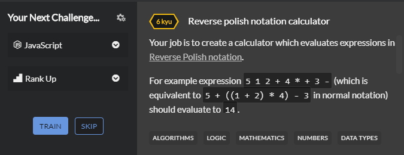

# Create a Calculator which evaluates expressions in Reverse Polish Notation.

In this posts, we are going to solve a CodeWars JavaScript Challenge where we will see how to evaluate a Reverse Polish Notation expression.

## What is Reverse Polish Notation?

Before going into the Reverse Polish Notation, we have to first look into Polish notation and the types of it to understand the difference clearly.

_Polish notation_ is a way of expressing arithmetic expressions. Its most basic distinguishing feature is that operators are placed on the left of their operands.

There are 3 types of polish notation:

1.  _Infix notation (operators come in between operands like normal usage)_

2.  _Prefix notation (operators come before operands)_

3.  _Postfix notation (operators are placed on the left of their operands)_

This is how reverse polish notation aka Postfix notation look like:

```javascript 
3 4 + 5 *
```
==> equivalent to (3+4) * 5 = 35

Sample testcase 1:

```javascript 
3 4 + 2 * 1 +
```
==> equivalent to (3+4) * 2 + 1 = 15

Sample testcase 2:

```javascript 
3 4 5 × −
```
==> equivalent to 3 - (4 * 5) = -17

___Before moving into CODEWARS Challenge, there are few assumptions to be noted:___
Assumption 1:
For your convenience, the input is formatted such that a space is provided between every token.

Assumption 2:
Empty expression should evaluate to 0.

Assumption 3:
Valid operations are +, -, *, /.

Assumption 4:
You may assume that there won't be exceptional situations (like stack underflow or division by zero).

<div style={{ padding: '20px', marginTop:'20px', marginBottom:'20px' }}>



</div>

## Steps for solving this problem

1. Format the input expression and create an empty array to add those numbers

2. Check for expression is empty or not before looping through.

3. Loop through expression and push the numbers to stack array. Once we are out of numbers, that means we have stepped up on operators, hence pop out the last two numbers and perform corresponding operations

4. Add the result to stack again.

5. If the stack has more than one number and we are out of operators, we return "ERROR" to the console, else return the result to console

Create a ```reverse_polish.js``` file where we will incorporate our logic.
I am using [CODE RUNNER VSCode extension](https://marketplace.visualstudio.com/items?itemName=formulahendry.code-runner) which will compile JS code with just one click rather than writing node reverse_polish.js everytime to compile.


<div className="single_agenda">

  1. Format the input expression and create an empty array to add those numbers

</div>

As said in the assumptions section, for our convenience space has been added in between the operands and operators. We will trim them down. And also create a new empty ```stack``` array used for push and pop out numbers.

```javascript
  function reversePolish(newExpr) {
    let expr = newExpr.split(" ");
    let stack =[];
  }

  console.log(reversePolish('1 3 5 * -'));
```

<div className="single_agenda">

  2. Check for expression is empty or not before looping through.

</div>

We will check if the expression is empty or not using strict equality operator and return 0 if it does. Finish, that's all. No digging in.
So far our code looks like this:

```javascript
  function reversePolish(newExpr) {
    let expr = newExpr.split(" ");
    let stack =[];

    if(expr === ''){
    return 0;
    }
  }

  console.log(reversePolish('1 3 5 * -')); 
```

<div className="single_agenda">

  3. Loop through expression and push the numbers to stack array. Once we are out of numbers, that means we have stepped up on operators, hence pop out the last two numbers and perform corresponding operations

</div>

Before looping through expression, we will validate if the input provided is a number and also check for if its finite. And if it is, then add those to array.

```javascript
  function reversePolish(newExpr) {
    let expr = newExpr.split(" ");
    let stack =[];

    if(expr === ''){
    return 0;
    }

    for(let i=0; i<expr.length; i++) {
      if(!isNaN(expr[i]) && isFinite(expr[i])) {
        stack.push(expr[i]);
    }
  }

  console.log(reversePolish('1 3 5 * -')); 
```

So we will console log the stack to see the numbers are added to the stack correctly.

```javascript
>>> [ '1', '3', '5' ]
```

Perfect! Now the else part will be executed, because we are out of numbers. We will pop out the last two numbers added.

```javascript
function reversePolish(newExpr) {
    let expr = newExpr.split(" ");
    let stack =[];

    if(expr === ''){
    return 0;
    }

    for(let i=0; i<expr.length; i++) {
      if(!isNaN(expr[i]) && isFinite(expr[i])) {
        stack.push(expr[i]);
    } else {
        let a = stack.pop();
        let b = stack.pop();
      }
    }

    console.log(reversePolish('1 3 5 * -'));
```
Now chain of nested if statements will be executed to check for operator. This can also be done through switch case statements, i prefer nestedIF conditional statements. Don't forget to convert before addition, as it is passed as a string into the function. Push it to the stack once operation is done.

```javascript
function reversePolish(newExpr) {
    let expr = newExpr.split(" ");
    let stack =[];

    if(expr === ''){
    return 0;
    }

    for(let i=0; i<expr.length; i++) {
      if(!isNaN(expr[i]) && isFinite(expr[i])) {
        stack.push(expr[i]);
    } else {
        let a = stack.pop();
        let b = stack.pop();
        if(expr[i] === "+") {
        stack.push(parseInt(a) + parseInt(b));
      } else if(expr[i] === "-") {
          stack.push(parseInt(b) - parseInt(a));
      } else if(expr[i] === "*") {
          stack.push(parseInt(a) * parseInt(b));
      } else if(expr[i] === "/") {
          stack.push(parseInt(b) / parseInt(a));
      } else if(expr[i] === "^") {
          stack.push(Math.pow(parseInt(b), parseInt(a)));
      }
    }
  }
}

console.log(reversePolish('1 3 5 * -'));
```
<div className="single_agenda">

  4. Add the result to stack again.

</div>

So according to the above steps first 3 and 5 would have been popped out from stack and the multiplication opeartion would have been completed. Let's confirm it by console logging at that point.

```javascript
  else if(expr[i] === "*") {
    stack.push(parseInt(a) * parseInt(b));
    console.log(stack);
  }

  LOG

  >>> [ '1', 15 ]
```

Perfect! The result is pushed to the stack array. Now the leftover is '-' operation and the same procedure will be followed.


<div className="single_agenda">

  5. If the stack has more than one number and we are out of operators, we return "ERROR" to the console, else return the result to console

</div>

This should be after the for loop.

```javascript
  if(stack.length > 1) {
    return "ERROR";
  }else {
    return stack[0];
  }
```

Final Code:

Github Repo (Give it a star if you like it): [https://github.com/subinedge/Weekly-algorithm-for-blog](https://github.com/subinedge/Weekly-algorithm-for-blog)

```javascript
function reversePolish(newExpr) {
  let expr = newExpr.split(" ");
  let stack =[];
   if(expr === ''){
    return 0;
  }
  
  for(let i=0; i<expr.length; i++) {
    if(!isNaN(expr[i]) && isFinite(expr[i])) {
      stack.push(expr[i]);
      
    }else {
      let a = stack.pop();
      let b = stack.pop();
      if(expr[i] === "+") {
        stack.push(parseInt(a) + parseInt(b));
      } else if(expr[i] === "-") {
          stack.push(parseInt(b) - parseInt(a));
        } else if(expr[i] === "*") {
            stack.push(parseInt(a) * parseInt(b));
        } else if(expr[i] === "/") {
            stack.push(parseInt(b) / parseInt(a));
        } else if(expr[i] === "^") {
            stack.push(Math.pow(parseInt(b), parseInt(a)));
        }
    }
  }

  if(stack.length > 1) {
    return "ERROR";
  }else {
    return stack[0];
  }

}

console.log(reversePolish('1 3 5 * -'));  // Result: -14
```