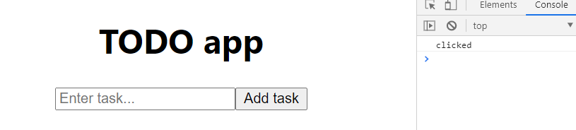

<div className="posts-wrapper">

  Welcome to our next posts in my React JS playlists for beginners. As we have dealt with the setup of React workflow without using Create React App, however in this posts, we will use the create react app to get the react boilerplate provided by Facebook. We will build a simple TODO application using the concepts that we learned in the introductory posts on ReactJS, which i will post down the link below.

  <br/>

  <div className="post-recommendation">

  <span className="previous-post">Check it out: </span><a href="http://localhost:8000/reactjs-intro-tutorial-with-no-existing-react-knowledge" target="_blank" aria-label="reactjs getting started guide"> REACT JS Concepts - This Tutorial Doesn’t Assume Any React Knowledge.</a>

</div>

  <br/>

## Features in TODO application:

<br/>

As a user, I can

* read a list of tasks

* add a task using the mouse or keyboard.

<br/>

## Steps involved in building TODO app

<br/>

1) Setting up React with CRA

2) Create UI of the TODO app

3) Setting up event handlers

4) Initialize State for input field

5) Update State on input value change

6) Adding onClick event on button

7) Store todos in array and manage it with state

8) Clearing console errors

9) Minor enhancements to todo app

<br/>

Finished TODO app Github Repo:

[https://github.com/subinedge/todo-app-reactjs-blog](https://github.com/subinedge/todo-app-reactjs-blog)

<br/>

## Step 1: Setting up React with CRA

<br/>

```cmd
npx create-react-app react-todo
```

<br/>

By using the above command in the VSCode terminal, you can get the boilerplate code for React. We will remove the unneccessary files like logo, css files.

## Step 2: Create UI of the TODO app

<br/>

I have created a separate component file called as FormTodo.js under the components folder.

```jsx
import React, { Component } from "react";

export default class FormTodo extends Component {
  render() {
    return (
      <div>
        <input type="text" />
        <button>Add task</button>
      </div>
    );
  }
}
```

<br/>

In the above code, i have created a input field with button for adding todo tasks inside of Class component.

### Why Class component instead of Functional component ?

<br/>

As I have said in the introductory post on ReactJS where the major setback of functional component is its inability to handle states (Assume React Hooks does not exist).In Class component, we can use state to handle the behavior of any element at different stages.

In this case, we can have state object with empty array for input field, as it should be empty at initial loading of webpage. And by clicking on Add task button and by setting event handlers, the entered task in input field will be pushed to state array (which was empty before).

If you haven't understood, don't worry I will explain through code.

## Step 3: Setting up event handlers

<br/>

Now we need to add event handlers for tracking the user entered value in input field and also listen for the onClick event on button.

```jsx
<input
  type="text"
  placeholder="Enter task..."
/>
```

<br/>

## Step 4: Initialize State for input field

<br/>

At the initial loading of webpage, the input field should be empty. And after every change in input field, the state should get track of the values inside the field, which we will do using ___inputChange___ method.

```jsx
  state = {
    inputValue: "",
  };

  {/* now we will bind the input field with state, by using this.state.inputValue */}

  <input
    value={this.state.inputValue} // empty string
  />
```

<br/>

You can view the state props declared for any element in the chrome developer tools by using ___React Developer Tools___ Extension. Navigate to components tab (which will be available once extension is installed) and select the element (in our case, the input field), which will show you the corresponding state declared.

Developer tools ___(Click on image to enlarge)___ : (Initial state)


<br/>

## Step 5: Update State on input value change

<br/>

Now we will update the state whenever the user changes value in input field by firing onChange event.

```jsx
<input onChange={this.inputChange} />

inputChange = (e) => {
  this.setState({
    inputValue: e.target.value,
  });
}
```

<br/>

This is how you update the state, by using setState with an object passed to it.
___e.target.value___ denotes the target field (target field = where user is active).
Now whatever the input field changes, the state has track of it.

Developer tools ___(Click on image to enlarge)___ : (Updated state)


<br/>

## Step 6: Adding onClick event on button

<br/>

```jsx
<button onClick={this.buttonSubmit}>Add task</button>

{/* we will check whether the onClick is working */}

buttonSubmit = (e) => {
  console.log("clicked");
};
```

<br/>



<br/>

## Step 7: Store todos in array and manage it with state

<br/>

We have to store the todo list in an array, which we will manage through state.
So, create todos empty array.

```jsx
state = {
  inputValue: "",
  todos: [], // empty
};
```

<br/>

Now using onclick event in button, we will add the input value that we stored in state to the todos array.

```jsx
buttonSubmit = (e) => {
    this.setState({
      todos: [this.state.inputValue],
    });
  };
```

<br/>

Now we have changed the state with setState and added the input value to the todos array. 

Now we will print it out in an ordered list. As it is an array, we will use ___map___ method to loop over each todo in todos array.

```jsx
{/* below the button element */}

<ol>
  {this.state.todos.map((todo) => (
    <li>{todo}</li>
  ))}
</ol>
```

<br/>

There's an issue in this. As you can see from the GIF below, the first item is getting added, after that the second item is not getting embedded, instead replacing the first one.

[](https://gifyu.com/image/WDbB)

<br/>

### The mistake we did

The mistake we made was, we didn't store the previous values of state, which we have to.

```jsx

//DON'T DO THIS

buttonSubmit = (e) => {
  this.setState({
    todos: [this.state.inputValue],
  });
};

  
// DO THIS..use spread operator

buttonSubmit = (e) => {
  this.setState({
    todos: [this.state.inputValue, ...this.state.todos],
    inputValue:"", // this will clear the input field once item added
  });
};
```

<br/>

We are copying the previous items in todos array using spread operator (...) and placing it at the end (in this case), where user entered value will be shown first.

Output:

[](https://gifyu.com/image/WDzn)

So we have more or less completed the todo list of populating todo list items.

So far:

```jsx
import React, { Component } from "react";

export default class FormTodo extends Component {
  state = {
    inputValue: "",
    todos: [],
  };

  inputChange = (e) => {
    this.setState({
      inputValue: e.target.value,
    });
  };

  buttonSubmit = (e) => {
    this.setState({
      // todos: [this.state.inputValue],
      todos: [this.state.inputValue, ...this.state.todos],
      inputValue: "", // input field clearing on submitting
    });
  };

  render() {
    return (
      <div>
        <input
          type="text"
          value={this.state.inputValue}
          placeholder="Enter task..."
          onChange={this.inputChange}
        />
        <button onClick={this.buttonSubmit}>Add task</button>
        <ol>
          {this.state.todos.map((todo) => (
            <li>{todo}</li>
          ))}
        </ol>
      </div>
    );
  }
}
```

<br/>

## Step 8: Clearing console errors

<br/>


Eventhough it is showing as an error in console, it won't stop the execution of your app. But, as a developer we should be able to deliver maximum efficiency. As the error says, it is expecting some unique value to each todo items, so we will pass the index of the list item.

```jsx
<ol>
  {this.state.todos.map((todo, index) => (
    <li key={index}>{todo}</li>// index = 0 for 1st item, index = 1 for 2nd and so on...
  ))}
</ol>
```

<br/>

## Step 9: Minor enhancements to todo app

<br/>

### Restrict adding empty strings to todo lists

<br/>

We will add validation on button click if input field is empty, and if yes, then don't add the empty string to todo list.

```jsx
buttonSubmit = (e) => {
  if (this.state.inputValue !== "") { // validation
    this.setState({
      todos: [this.state.inputValue, ...this.state.todos],
      inputValue: "",
    });
  }
};
```

<br/>

### Add todo item to list on pressing ENTER

<br/>

To add task to todo list item on pressing ENTER, then we have to enlose the input and button tags inside the form element and also by adding the onSubmit event.

```jsx
<form onSubmit={this.buttonSubmit}>
  <input>....
  <button>....
  <ol>.....        
</form>
```

<br/>

Then if you think, now you can add item to your todo list, YOU ARE WRONG !!! Form won't let you add the item, it will try to submit the form, which is the default behavior of it. So in buttonSubmit function, add ___e.preventDefault()___ at start to avoid default form submit behavior.

```jsx
buttonSubmit = (e) => {
  e.preventDefault();
  ......
}
```

</div>