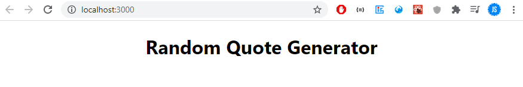
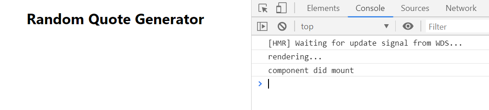

<div className="posts-wrapper">

  Welcome to our next posts on building a Quote generator web application in my React JS playlists for beginners. In the previous posts, we built a simple todo application and learnt the use of State and how to update state. In this post, we will build a random quote generator using Advice Slip JSON API, where you can generate random advice or you can generate advice using ID (by using Math.random()) or using search paramter at last of endpoint URL, like below: https://api.adviceslip.com/advice/search/{query}.

  If you are not sure how states in ReactJS work, don't worry, I have post for you explained with simple project using it.

  <br/>

  <div className="post-recommendation">

  <span className="previous-post">Check it out: </span><a href="https://javascriptwillrule.com/reactjs-building-todo-app-for-beginners" target="_blank" aria-label="reactjs todo app building"> Build A Simple TODO App With React and understand how state works </a>

  </div>

  <br/>

## Features in Quote generator JSON API application:

<br/>

Simple UI, where on clicking button, app will generate a random quote by invoking ADVICE SLIP JSON API.

## What you will learn by building a quote generator:

<br/>

1) Learn how and when to use component lifecycle methods in ReactJS.

2) Where and how to call API in ReactJS.

3) Learn to update state in React JS

<br/>

## What we will be building:

<br/>

[](https://gifyu.com/image/cV4J)

<br/>

## Steps involved in building quote generator

<br/>

1) Setting up React with CRA

2) Setting up state

3) Understanding which lifecycle method to use

4) Using AXIOS to fetch data from API

5) Updating state and showing quote in UI

6) Adding onClick event on button to show quote

<br/>

Finished Quote API Github Repo:

[https://github.com/subinedge/ReactJS-API-Intro-blog](https://github.com/subinedge/ReactJS-API-Intro-blog)

<br/>

Okay. Let's get started.

## Step 1: Setting up React with CRA

<br/>

First step, install Create react app.

```cmd
npx create-react-app ./

{/* Once installed... */}

npm start
```

<br/>

For some of you, the above command might be new. ```npx``` is an npm executable tool which takes care of everything, from installing to running the package. 

For simple understanding, ```npx``` eliminates ```npm install```.And ./ will create the project inside of the current directory, which means don't create a separate folder inside current working directory.

Once installed, remove unneccessary files and imports that React Boilerplate comes with. I have removed the logo, test and service worker files ,where i am left with App.css, index.css, app.js and index.js files only. Don't forget to remove the logo and service worker file imports in your application.

Don't forget to change the functional App component to Class component, as we will be using state.

Change it like below:

```jsx
import React, { Component } from "react";
import "./App.css";

class App extends Component {
  render() {
    return (
      <div className="App">
        <h1>Random Quote Generator</h1>
      </div>
    );
  }
}

export default App;
```

<br/>

So far:



<br/>

## Step 2: Setting up state

<br/>

In the App component, we are going to have a state, which is nothing but a global object for that specific component. In that state, we are going to store the advice that we are getting from API response.

```jsx
state = {
  advice: "",
}
```

<br/>

## Step 3: API call in componentDidMount lifecycle method

<br/>

Next step is to hit the API. In JavsScript, we will be either using AXIOS or inbuilt fetch method for accessing API data wrapped within a function. But in React we will be enclosing the API requests in a lifecycle method.

You may be thinking, what do you mean by lifecycle method ?

In simple terms, lifecycle methods are nothing but series of methods that are invoked in different stages of component's existence. The different stages are:

* Initialization - stage where the component is constructed

* Mounting - stage where rendering the JSX returned by the render method

* Updating - stage when the state of a component is updated and DOM repainted

* Unmounting - stages where component is removed from page.

These are the different stages in lifecycle methods. These stages have inbuilt methods that can be used to do that specfic task.

In our case for API requests, we are going to use componentDidMount method which comes under ___Mounting___ stage. The componentDidMount method will get executed once the render method finishes the rendering.

We will test that whether it is true or not by placing console log in render and componentDidMount methods.

```jsx

componentDidMount() {
  console.log("component did mount");
}

render() {
  return (
    <div className="App">
      <h1>Random Quote Generator</h1>
      {console.log("rendering...")}
    </div>
  );
}
```

<br/>

Output:



<br/>

Now we are sure about which lifecycle method to use. Next we will try to call the API through AXIOS library (Axios is a HTTP client).

<br/>

## Step 4: Using AXIOS to fetch data from API

<br/>

Installing AXIOS

```cmd
npm install axios
```

<br/>

Import axios in App.js

```jsx
import axios from "axios";
```

<br/>

Now we will hit the API with GET request on button click. So instead of writing the fetch request inside the componentDidMount, we will write it in separate method, so that we can use that in button onClick property.

```jsx
fetchQuote = () => {
  axios.get("https://api.adviceslip.com/advice").then((response) => {
    console.log(response);
  });
};
```

<br/>

```jsx
componentDidMount() {
  this.fetchQuote();
}
```

<br/>

Console log:

We will be receiving bunch of properties as response, but we are going to concentrate on the ___data___ property which has an id and advice quote to it.

```json
"data": {
  "slip": {
    "id": 3,
    "advice": "Don't eat non-snow-coloured snow."
  }
}
```

<br/>

## Step 5: Updating state and showing quote in UI

<br/>

So we got the quote from API response. Now we have to populate it in our webpage. Instead of console logging it, we will update the state inside the ___.then___  method.

We are not going to destructure the response as i don't want beginners to get confused. (If you're hearing destructuring for first time, leave it... i will cover that in separate posts).

```jsx
fetchQuote = () => {
  axios.get("https://api.adviceslip.com/advice").then((response) => {
    {/* update state */}
    this.setState({ advice: response.data.slip.advice });
  });
};
```

<br/>

Now, populate the update state in UI.

```jsx
<div className="App">
  <h1>Random Quote Generator</h1>
  <h3>{this.state.advice}</h3>
</div>
```

<br/>

Output:


<br/>

## Step 6: Adding onClick event on button to show quote

<br/>

```jsx
<button onClick={this.fetchQuote}>
  <span>Fetch Quote</span>
</button>
```

<br/>

Output:

[](https://gifyu.com/image/cV4J)

</div>