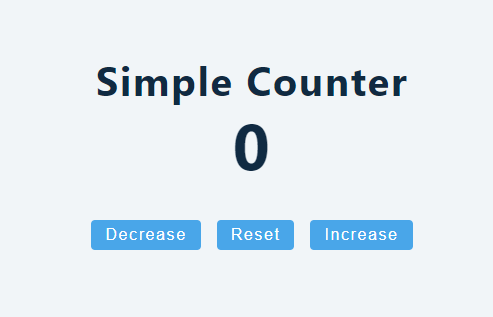

<div className="posts-wrapper">

  Hooks are a new proposal that lets you use state and other React features without using a class. In simple terms, we can use state in functional components. In the earlier posts, i would have said, functional components are presentational components and if you need to write logic or change the state of the element based on event trigger or click, then we have to use class components where we will use state.

  And you also know that in class components we have to write more lines of code for using a simple state manipulation, where we can do that easily in functional component with the help of React useState hook.

  <div className="blockquote">
    React hooks are new addition in React 16.8.0. So make sure you have installed/upgraded your packages. including React DOM.
  </div>

  Let's dive into simple usage of react hooks in functional components.

  ### App.js:

  <br/> 

```jsx
  import React, { useState } from "react"; // import named useState hook from react
  import "./index.css";

  function App() {

    return (
      <React.Fragment>
        <section style={{margin:'4rem 0', textAlign: "center"}}>
          <h2>Simple Counter</h2>
          <h1>0</h1>

          <button className="btn">Decrease</button>
          <button className="btn">Reset</button>
          <button className="btn">Increase</button>
        </section>
      </React.Fragment>
    );
  }

  export default App;
```

<br/>

We have imported useState hook from React package which will take care of state manipulation in functional components. In the JSX part, we have hard-coded 0 in h1 element and added three butttons to increase/decrease and resetting the counter.

In below, useState is a hook, which we will call inside a function to make it as local state.

<br/>

```jsx
  function App() {

    // useState
    const [counter, setCounter] = useState(0);

    return (
      <React.Fragment>
        <section style={{ margin: "4rem 0", textAlign: "center" }}>
          <h2>Simple Counter</h2>
          <h1>{counter}</h1>

          buttons....
        </section>
    </React.Fragment>
  );
}
```

<br/>

There is no compulsion that useState hook has to be used only once. It can be used many times as you wish.

```jsx
function App() {
  // Declare multiple state variables!
  const [counter, setCounter] = useState(0);
  const [loading, setLoading] = useState(false);
  const [error, isError] = useState(
    [
      {
        id:1,
        name:"Subin",
        designation:"Front end developer"
      }
    ]
  );
  // ...
}
```

<br/>

React state hooks set us two values to set and manipulate state, One is variable which can contain array/string/number/boolean/object and also second parameter is the function that helps us to update the state (which is equivalent to ___this.setState___ in class components). In the above example, counter is the initial state value which is set as 0 (the value which you give in useState is the initial state).

Once the initial state is set, we will pass counter variable value in the header h1 element, which will be set as 0.

So far:



<br/>

## Handling click events:

<br/>

```jsx
  <button className="btn" onClick={decreaseCounter}>Decrease</button>
  <button className="btn" onClick={resetCounter}>Reset</button>
  <button className="btn" onClick={increaseCounter}>Increase</button>
```

<br/>

We have added onClick events for all three buttons where the logic for decrease will be reducing the counter value to 1 and resetting will set counter to 0 and finally increase handler will increase the counter by 1. Now we will setup the function.

<br/>

```jsx
  const decreaseCounter = () => {
    setCounter(counter - 1);
  };

  const resetCounter = () => {
    setCounter(0);
  };

  const increaseCounter = () => {
    setCounter(counter + 1);
  };
```

<br/>

Now we have set the functions with necessary logics on manipulating the state with setCounter function. That's it. We have completed a basic state manipulation using react state hooks. Output looks like below:

<br/>

## Code:

<br/>

```jsx
import React, { useState } from "react";
import "./index.css";

function App() {
  const [counter, setCounter] = useState(0);

  const decreaseCounter = () => {
    setCounter(counter - 1);
  };

  const resetCounter = () => {
    setCounter(0);
  };

  const increaseCounter = () => {
    setCounter(counter + 1);
  };

  return (
    <React.Fragment>
      <section style={{ margin: "4rem 0", textAlign: "center" }}>
        <h2>Simple Counter</h2>
        <h1>{counter}</h1>

        <button className="btn" onClick={decreaseCounter}>
          Decrease
        </button>
        <button className="btn" onClick={resetCounter}>
          Reset
        </button>
        <button className="btn" onClick={increaseCounter}>
          Increase
        </button>
      </section>
    </React.Fragment>
  );
}

export default App;
```

<br/>

## Output:

<br/>

[](https://gifyu.com/image/8A4l)

</div>
