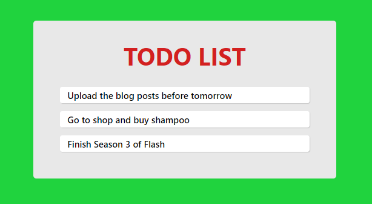
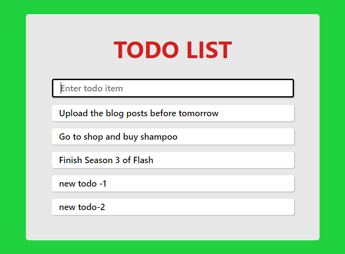

<div className="posts-wrapper">

Hope you have learned something about React useState hook and why we are migrating from class based components to functional components, where we built a simple counter application. In this post, we will further strengthen our knowledge on building a traditional todo list application using useState hook.

By this end of this post, you will have a strong foundation of useState hook by adding and removing values from state by manipulating the same.

<div class="blockquote">
GITHUB REPO:

https://github.com/subinedge/react-hooks-todo-list

</div>

Let's get started.

```cmd
npx create-react-app react-todo-hooks
```
<br />

Once installation done, remove all unnecessary test and service worker files, also remove the class component code in **_App.js_** and add the below code.

```jsx
import React, { useState } from "react"

function App() {
  return <h2>Todo list using React Hooks</h2>
}

export default App
```
<br />

Above is the simple code where i have imported useState from react package. If you followed my previous posts on React Hooks, you would know that useState gives us two variables where first one holds the state value (In class component it is **_this.state_**) and second is a function which is responsible for updating the state value (In class component it is **_this.setState_**).

Now we will initialize the state variables, where we will set some 3 todos initially in the todo variable as array of objects. We will have one more property as **_hasCompleted_** which we will toggle the completion status based on the user click on the complete button next to every todos.

```jsx
function App() {
  const [todo, setTodo] = useState([
    {
      text: "Upload the blog posts before tomorrow",
      hasCompleted: false,
    },

    {
      text: "Go to shop and buy shampoo",
      hasCompleted: false,
    },

    {
      text: "Finish Season 3 of Flash",
      hasCompleted: false,
    },
  ])
}
```
<br />

Now we will return these 3 todos and display it in webpage.

```jsx
return (
  <div className="app">
    <div className="todo-list">
      {todos.map((todo, index) => {
        return <Todo key={index} todo={todo} />
      })}
    </div>
  </div>
)
```
<br />

What we have done is simply looped through the todos state variable which has the todo list items. Instead of displaying in the same **_App.js_** file, we will return a Todo component with props index and todo object.

Index plays a vital role in removing todos or marking completion status as React will expect ID to identify which component has been clicked and to be removed. So make sure you pass that in props.

Next, we will create a todo.js component:

### Todo.js:
<br />

```jsx
import React, { useState } from "react"

function Todo({ key, todo }) {
  return <div className="todo">{todo.text}</div>
}

export default Todo
```
<br />

I will add some CSS styling to make it look good:

### index.css:

<br/>

```css
* {
  margin: 0;
  padding: 0;
  box-sizing: border-box;
}

.app {
  background: #20d33e;
  width: 100%;
  padding: 30px;
  height: 100vh;
}

h1 {
  font-family: -apple-system, BlinkMacSystemFont, "Segoe UI", Roboto, Oxygen,
    Ubuntu, Cantarell, "Open Sans", "Helvetica Neue", sans-serif;
  text-align: center;
  color: #d32020;
  margin-bottom: 20px;
}

.todo-list {
  background: #e8e8e8;
  border-radius: 4px;
  padding: 25px;
  max-width: 400px;
  margin: auto auto;
}

.todo {
  font-family: -apple-system, BlinkMacSystemFont, "Segoe UI", Roboto, Oxygen,
    Ubuntu, Cantarell, "Open Sans", "Helvetica Neue", sans-serif;
  font-weight: 600;
  background: #fff;
  box-shadow: 1px 1px 1px rgba(0, 0, 0, 0.15);
  padding: 3px 10px;
  font-size: 12px;
  margin: 10px;
  border-radius: 3px;
  display: flex;
  justify-content: space-between;
  align-items: center;
}
```
<br />

So far:


<br />

## Add input field for adding new todo list items

<br/>

We will have a seperate component for the form submission.

### TodoForm.js:

<br/>

```jsx
import React, { useState } from "react"

function TodoForm({ addTodo }) {
  const [value, setValue] = useState("")

  return (
    <form onSubmit={handleSubmit}>
      <input
        type="text"
        className="input"
        autoFocus
        value={value}
        placeholder="Enter todo item"
        onChange={e => setValue(e.target.value)}
      />
    </form>
  )
}

export default TodoForm
```
<br />

First we have initialized two state variables with value variable as empty string, which we will map it to input field initially as there wont be any text. **_onChange_** property will track the changes in input field and if so, state gets updated. We will use **_handleSubmit_** function to add the updated value to todo list item.

```jsx
const handleSubmit = e => {
  e.preventDefault()

  if (!value) return

  addTodo(value)
  setValue("")
}
```
<br />

**_e.preventDefault()_** will prevent form from submitting. If there is no value in input field, do nothing !, else invoke addTodo function and pass the updated state value as an argument to function and once todo list item added, make the input field empty.

### App.js:

<br/>

```jsx
const addTodo = text => {
  const newTodos = [...todos, { text }]
  setTodos(newTodos)
}
```
<br />

Make sure you copy the old todo list items using spread operator and add your new object inside the array. The reason why I enclosed the text in curly braces is because, the value has to be treated as an object and not a normal text which will fail if i do so. And make sure to update the **_setTodos_** method with newTodos.

In App.js, import/add the TodoForm component and pass addTodo as prop.

```jsx
<TodoForm addTodo={addTodo} />
```
<br />

So far:


<br />

## Add complete todo for each item
<br />

Now we will add complete todo functionality where when user clicks the complete button will strike through the selected todo item and if you wish/mistakenly clicked the complete button, clicking one more time will remove the completion strike through on that todo item.

### Todo.js:

<br/>

```jsx
  <div>
    <button className="btn" onClick={() => completeTodo(index)}>
      <a href="#">Complete</a>
    </button>
  </div>
```

<br/>

We added a simple button and onClick function as completeTodo with index as parameter passed. We will create this function in ___App.js___.

```jsx
const completeTodo = (index) => {
  const newTodos = [...todos];
  newTodos[index].hasCompleted = !newTodos[index].hasCompleted;
  setTodos(newTodos);
};
```

<br/>

Before making any changes in the current todo list, we will make a copy of it using spread operator.
We will change the object property ___hasCompleted___ to opposite boolean value and set the updated todos to the setTodos method.

Now we will add inline style for adding strike through over todo item using ternary operator.

### Todo.js:

<br/>

```jsx
<div style={{ textDecoration: todo.hasCompleted ? "line-through" : "none" }} className="todo">
  {todo.text}
  <div>
    <button className="btn" onClick={() => completeTodo(index)}>
      <a href="#">Complete</a>
    </button>
  </div>
</div>
```

<br/>

### App.js:

<br/>

```jsx
{todos.map((todo, index) => {
  return <Todo index={index} todo={todo} completeTodo={completeTodo} />;
})}
```

<br/>

Now import the passed completeTodo prop in Todo.js file.

<div class="blockquote">
  DON'T WORRY ABOUT THE CODE, I WILL POST THE GITHUB REPO URL for your check
</div>

So far:

[](https://gifyu.com/image/RWev)

<br/>

## Add remove todo for each item
<br />

### Todo.js:

<br/>

```jsx
  <div>
    <button className="btn btn-remove" onClick={() => removeTodo(index)}>
      <a href="#">Remove</a>
    </button>
  </div>
```

<br/>

### App.js:

<br/>

```jsx
const removeTodo = (index) => {
  const newTodos = [...todos];
  newTodos.splice(index, 1);
  setTodos(newTodos);
};
```

<br/>

We will follow the same way as completeTodo method, as copy the todos object and to remove the todo item, use splice method by passing the index and number of items to be removed.
Finally set the updated todos to setTodos method.

<br/>

[](https://gifyu.com/image/RWeL)

<br/>

<div class="blockquote">
GITHUB REPO:

https://github.com/subinedge/react-hooks-todo-list

</div>

THAT'S IT !!! THANKS FOR READING

</div>
