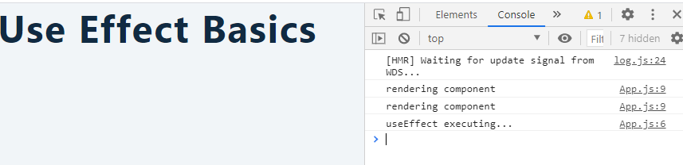
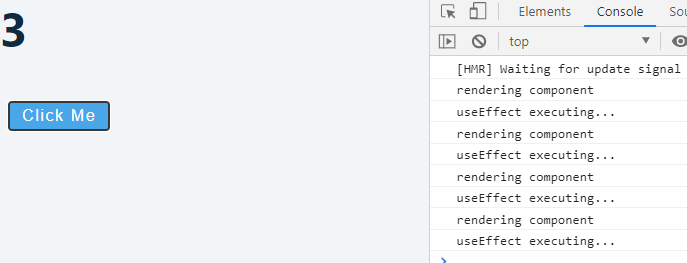
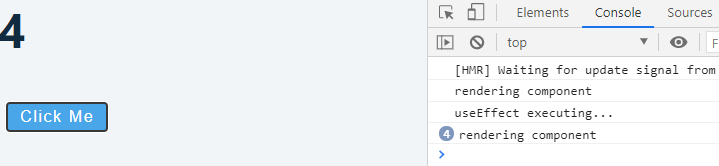
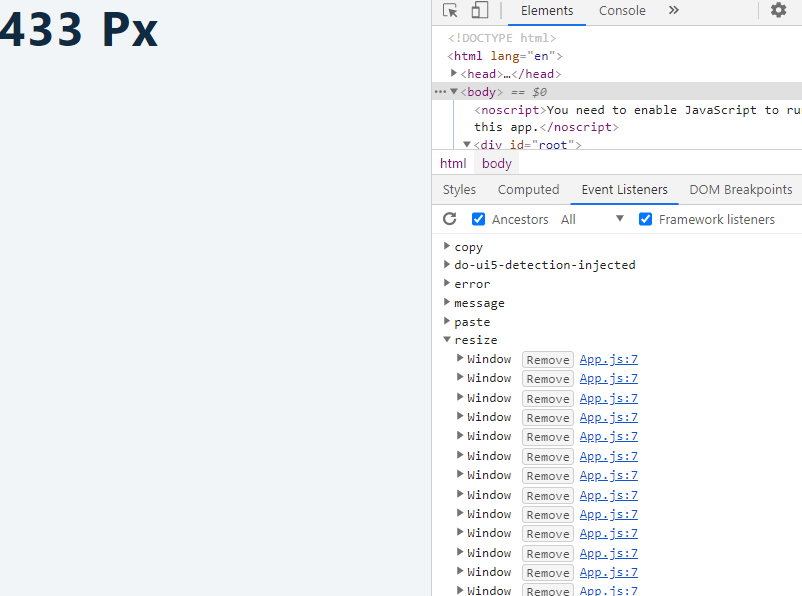
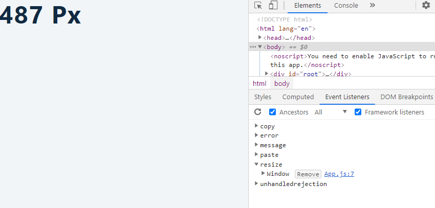

<div className="posts-wrapper">

  We are done with the first part of React Hooks where we covered on how to implement state in functional components with useState hook by building a simple Todo list application.
  
  In this post, we will see on useEffect hook, why we need it and how to implement it in functional components.

  <div className="post-recommendation">
    <span className="previous-post">Check it out: </span>
    <a href="https://javascriptwillrule.com/strengthen-react-hooks-knowledge-by-building-todo-list-app-from-scratch" target="_blank" aria-label="react hooks todo app building"> Build ToDo List App Using React Hooks From Scratch </a>
  </div>

  ## What is useEffect ?

  <br/>

  By using this hook, you tell React that to execute this method after every component render by default. In class components, you have many lifecycle hooks for controlling component mounting and updating through componentDidMount and componentDidUpdate. By replacing them all in one hook, we have useEffect in place.

  As said, useEffect runs on every component render but by passing relevant parameter we can control the execution of useEffect hook from executing multiple times or executing only when needed.

  ## How to use useEffect ?

  <br/>

  First, import the useEffect from react package as below

  ```jsx
  import React, {useState, useEffect} from 'react';
  ```

  <br/>

  Now we will setup a useEffect hook inside the functional component. Before going with an example on how it works, let's see on what order useEffect hook is executing.

  ```jsx
  const UseEffectBasics = () => {

    useEffect(()=> {
      console.log('useEffect executing...')
    });

    console.log('rendering component');

    return <h2>UseEffect Basics</h2>
  }
  ```

  <br/>

  ### Console:

  <br/>

  

  <br/>

  <div class="blockquote">
    Don't get confused on rendering component appearing twice in console. It is because of wrapping your App component within <i>React.StrictMode</i> in index.js file.
  </div>

  <br/>

  You can see in the console the order of execution.

  ### Re-rendering process in useEffect hook

  <br/>

  In this example, we will have a h1 tag which will increment on button click.

  ```jsx
function App() {
  const [title, setTitle] = useState(0);
  useEffect(() => {
    console.log("useEffect executing...");
  });

  console.log("rendering component");

  return (
    <React.Fragment>
      <h1>{title}</h1>
      <button onClick={() => setTitle(title + 1)}>Click me</button>
    </React.Fragment>
  );
}
  ```

  <br/>

  onClick event will trigger the setTitle state to current title value + 1. And on every button click the component gets re-rendered with useEffect calling getting executed everytime.

  ### Console:

  <br/>

  

  <br/>

  <div class="blockquote">
    <i>Note</i> : Do not use IF conditionals to wrap useEffect to work on specific conditions. 
  </div>

  <br/>

  ## Control useEffect rendering process

  <br/>

  React gives us a facility to handle the execution of useEffect hook on every re-render by adding an argument to the hook.

  ```jsx
  useEffect(() => {
    console.log("useEffect executing...");
  }, []);
  console.log("rendering component");
  ```

  <br/>

  

  <br/>

  As you can see from the console, the useEffect is called only once which is because of the empty array that we are passing.

  Second Argument takes in state values in it. In the above example,we have empty array which means dont re-render as i dont have anything in array.

  If you pass title state value inside the array, then on every setTitle change, useEffect will be executed.


  ## Cleanup function

  <br/>

  In the below example on browser resize, we are not passing the dependency array as a second argument. There is a negative effect that i will show you on using event listeners inside useEffect.

  ```jsx
function App() {
  const [size, setSize] = useState(window.innerWidth);

  const checkSize = () => {
    setSize(window.innerWidth);
  };
  useEffect(() => {
    window.addEventListener("resize", checkSize);
  });

  return (
    <React.Fragment>
      <h1>{size} px</h1>
    </React.Fragment>
  );
}
  ```

  <br/>

  ### Console

  <br/>

  

  <br/>

  As you can see in the console, on every browser resize the event listeners are keep on increasing which will inturn decrease the performance of the site in the long run.

  So removing the event listeners parallely at the end of useEffect call will do the job.

  ```jsx
  // add this return at end of useEffect call

  useEffect(() => {
    window.addEventListener("resize", checkSize);

    return () => {
      window.removeEventListener("resize", checkSize);
    };
  });
  ```

  <br/>

  ### Console

  <br/>

  

  <br/>

  In the next post, we will see how to do API call in useEffect hook.

</div>
