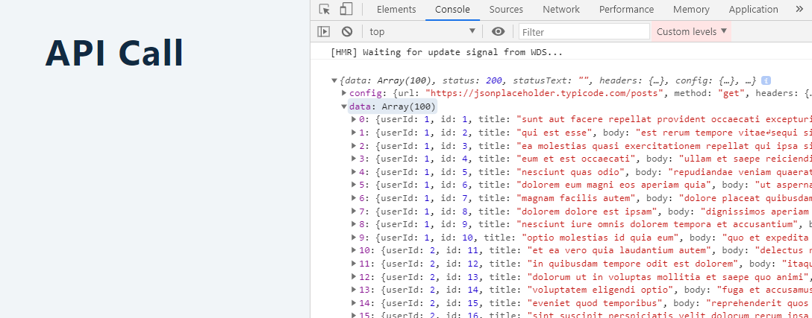
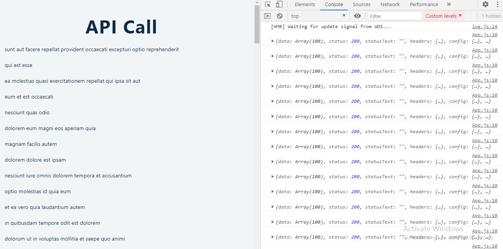
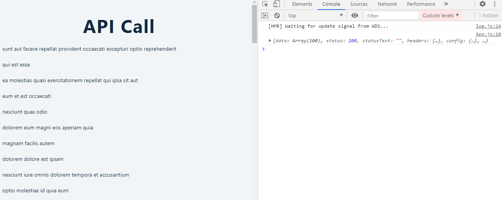

<div className="posts-wrapper">

  By now everyone should have solid understanding of state and effect hook. In this post, we will apply the acquired knowledge to see how to fetch data from an API endpoint.

  One point you should know though in future, a new feature called SUSPENSE would be incharge for data fetching. Nevertheless using state and effect hooks to acheive the same is a great way to solidify the understanding of those hooks.

  <div className="post-recommendation">
    <span className="previous-post">Check it out: </span>
    <a href="https://javascriptwillrule.com/quick-intro-to-react-hooks-with-useEffect-with-example" target="_blank" aria-label="useEffect intro in reactjs"> A Quick Intro to React Hooks with useEffect </a>
  </div>

  Let's get started.

  ## Install Axios for data fetching

  <br/>

  You could use fetch API, but i would prefer axios for data fetching.

  ```cmd
  npm i axios
  ```

  <br/>

  Once the axios installation is over, the package should be present in your ___package.json___.

  ## Create component for data fetch logic

  <br/>

  ___DataFetching.json___

  Import necessary hooks, useState and useEffect from react and also axios.

  ```jsx
  import React, { useState, useEffect } from "react";
  import axios from "axios";
  ```

  <br/>

  We have necessary imports added, next step is to fetch data. For that we are going to be using JSON PLACEHOLDER (https://jsonplaceholder.typicode.com/) which is a fake REST API developed for testing purpose.

  In the Resources section, you will find the 6 common endpoints that they have provided. Click on any endpoint to see the desired JSON results.

  We will use "/posts" endpoint which will provide array of 100 posts. First we are going to create a new state variable ___posts___ and ___setPosts___ function for updating state ___posts__.

  ```jsx
  const [posts, setPosts] = useState([]); // initial posts value set to empty array
  ```

  <br/>

  Now we will create effect to fetch data from URL endpoint. useEffect accepts arrow function, in that function we make our GET requests using axios.

  ```jsx
  useEffect(()=> {
    axios.get("https://jsonplaceholder.typicode.com/posts") // returns promise
    .then ((response)=> console.log(response));
  })
  ```

  <br/>

  ### Console:

  <br/>

  

  <br/>

  Array of 100 posts has been listed. Next step, is to render the lists of posts in the browser.

  ## Render the posts 

  <br/>

  ```jsx
  <ul>
        {posts.map((post) => {
          return (
            <li style={{ margin: "20px 0 0 40px" }} key={post.id}>
              {post.title}
            </li>
          );
        })}
      </ul>
  ```

  <br/>

  Right after logging out the fetched object, update the state using setPosts function which will then be rendered in the UI.

  ```jsx
    useEffect(() => {
    axios.get("https://jsonplaceholder.typicode.com/posts").then((response) => {
      console.log(response);
      setPosts(response.data);
    });
  });
  ```

  <br/>

  

  <br/>

  We can in the console that the posts titles are rendered in the UI, but if you take a look at the console, we can see that api call has been keep on running for infinite loop of data fetching. Instead we have to fetch either if someone updates the state or only at the beginning.

  This can be acheived by adding empty dependency array as second parameter.

  ```jsx
  useEffect(() => // function.., []);
  ```

  <br/>

  

  <br/>

  If you now look into the browser, the data is fetched only once and the same is rendered in the UI. So this is pretty much how we fetch data with useEffect. 

</div>
