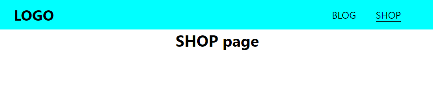

<div className="posts-wrapper">

  ## What is React Router ?

  <br/>

  Before getting into react router, we need to understand the concept of Routing. Routing is the process of navigating in webpage through links/URL. 

  React router allows us to navigate to different parts of a webpage without reloading the webpage on clicking any links, which will increase the transition phase in navigation smoother.

  There are 2 types of Routing:

  * Normal Routing

  * Dynamic Routing

  <br/>

  ## Normal Routing

  <br/>

  Say, we have navbar with links "Home, Blog, Contact, About" and logic we use for navigating is by using anchor tag as below:

  ```jsx
  <a href="/home">Home</a>
  ```

  <br/>

  Instead of using Anchor tag we will use ___Link___ tag.

  ```jsx
  <Link to="/home">Home</Link>
  ```

  <br/>

  This is normal routing, where we know the endpoint (like www.javascriptwillrule.com/about).

  ## Dynamic Routing

  <br/>

  There are cases where we don't know the exact endpoint like about, home, blog etc. For eg., in Amazon website, you can see there are multiple products listed out in shop page (assume like amazon.com/shop), and when you click on any specific item you will be directed to that specific item page. If you watch closely, the URL would be like amazon.com/shop/d4fg68hujiksedrftgyhu (amazon.com/shop/{id}). This is called Dynamic Routing, where we don't know the exact endpoint and this can be done using React Router.

  Let's see the above concepts with real world examples.

  Final Output:

  [](https://gifyu.com/image/jyo3)

  ## Install CRA and react router package

  <br/>

  Install Create React app and react-router-dom package.

  ```jsx
  npx create-react-app ./
  npm i react-router-dom
  ```

  <br/>

  ## 1) Normal Routing example

  <br/>

  We will setup a navbar with menu links Blog and Shop and apply basic styles.

  ### Navbar.js:

  <br/>

  ```jsx
  function Navbar() {
    return (
      <nav>
        <h1>LOGO</h1>
        <ul>
          <li>Blog</li>
          <li>Shop</li>
        </ul>
      </nav>
    );
  }

  export default Navbar;
  ```

  <br/>

  ### Navbar.css

  <br/>

  ```css
  nav {
    display: flex;
    justify-content: space-between;
    align-items: center;
    padding: 10px 30px;
    background-color: aqua;
    text-transform: uppercase;
    font-size: 20px;
  }

  ul {
    display: flex;
    list-style: none;
  }

  li {
    margin-right: 40px;
    cursor: pointer;
  }
  ```

  <br/>

  ## Add link component over the menu items

  <br/>

  Instead of using anchor tag, we will use Link tag (available in react router dom package). With "to" property we can define the path to which menu item should be navigated.

  ### Navbar.js

  <br/>

  ```jsx
  import { Link } from "react-router-dom";

  <Link to="/">
    <h1>LOGO</h1>
  </Link>
  <ul>
    <Link to="/blog">
      <li>Blog</li>
    </Link>

    <Link to="/shop">
      <li>Shop</li>
    </Link>
  </ul>
  ```

  <br/>

  ### App.js

  <br/>

  ```jsx
  import "./App.css";
  import Navbar from "./Navbar";
  
  function App() {
    return (
      <div>
        <Navbar />
      </div>
    );
  }

  export default App;

  ```

  <br/>

  Once above setup is done, system will throw below error, which is obvious as we didn't setup the router functionality. Below error means that, if you are using Link component (which is from router dom package), you must enclose that component inside Router component.

  

  <br/>

  For accessing the Router functionality, we need to import BrowserRouter, Route, Switch from react router dom package.

  * BrowserRouter - It uses HTML5 history API to keep your UI in sync with the URL. Simple explanation is that, it will help browser store the URL.

  * Route - It tells your app which other components to display on the route.

  DONT WORRY !!! WITH EXAMPLE YOU WILL GET IT

  ### App.js

  <br/>

  ```jsx

  import { BrowserRouter as Router, Route} from "react-router-dom";
  {/* IMPORT DONE , "as" = alias */}

  <div>
    <Router>
      <Navbar />
    </Router>
  </div>
  ```

  <br/>

  ## Create Blog and Shop component

  <br/>

  We will create simple Blog and Shop component. Create pages folder inside src and import both the components in the App component (below the Navbar component).

  ```jsx
  <div>
    <Router>
      <Navbar />
      <Blog />
      <Shop />
    </Router>
  </div>
  ```

  <br/>

  

  <br/>

  Now in the ouput all components will be displayed, so to route the links to respective component pages, let's use Route.

  ```jsx
  import Navbar from "./Navbar";
  import Blog from "./pages/Blog";
  import Shop from "./pages/Shop";
  import { BrowserRouter as Router, Route } from "react-router-dom";

  <Router>
    <Navbar />
    <Route path="/blog" component={Blog} />
    <Route path="/shop" component={Shop} />
  </Router>
  ```

  <br/>

  Respective components will be routed on menu item click as below.

  

  <br/>

  Okay, next we will create Home component and try to load it when user clicks on LOGO.

  ### Home.js

  <br/>

  ```jsx
  function Home() {
    return (
      <div className="App">
        <h1>HOME page</h1>
      </div>
    );
  }
  ```

  <br/>

  Now we will load the Home component in App component and add the route path to "/".

  ### App.js

  <br/>

  ```jsx
  import Home from "./pages/Home";

  <Router>
    <Navbar />
    <Route path="/" component={Home} />
    <Route path="/blog" component={Blog} />
    <Route path="/shop" component={Shop} />
  </Router>
  ```

  <br/>

  

  <br/>

  Now when you see the output, you can observe that when we click on Blog link, both blog and home component gets rendered. We will analyze line by line.

  First route path to home component is "/", which works fine. In the next route path "/blog", react router checks each and every character in path attribute. First it encounters the "/", so it renders the Home component, and then only "blog" is being read, so blog component is rendered.

  To avoid this, we have to specify that Home component should be rendered only when path matches ___exactly___ "/". For that include exact keyword like below.

  ```jsx
  <Route path="/" exact component={Home} />
  ```

  <br/>

  

  <br/>

  ## Import NavLink component for styling active element

  <br/>

  React router comes up with another useful feature called NavLink, where we can style the active element based on the user selection. For eg., if user clicks a navbar menu item, then style specified for that class will be added with just one attribute added to the NavLink component.

  Import the NavLink as you did for Link component from package react-router-dom. Add the attribute "activeClassName" within the NavLink component and provide the class name for that.

  ### Navbar.js

  <br/>

  ```jsx
  import { Link, NavLink } from "react-router-dom";

  <nav>
    <Link to="/" className="nav-link">
      <h1>LOGO</h1>
    </Link>
    <ul>
      <NavLink to="/blog" activeClassName="selected" className="nav-link">
        <li>Blog</li>
      </NavLink>

      <NavLink to="/shop" activeClassName="selected" className="nav-link">
        <li>Shop</li>
      </NavLink>
    </ul>
  </nav>
  ```

  <br/>

  ### Navbar.css

  <br/>

  ```css
  .selected {
    border-bottom: 1px solid black;
  }
  ```

  <br/>

  You can also provide inline style but the attribute for that is "activeStyle". 

  ```jsx
  <NavLink to="/blog" activeStyle={{borderBottom:"1px solid black"}}>BLOG</NavLink>
  ```

  <br/>

  From below image, we can see that the blog link is selected and styles got updated.

  

  <br/>

  <hr/>

  <br/>

  ## 2) Dynamic Routing example

  <br/>

  Now we will see an example on how react router facilitates dynamic routing. For that, we will render list of items in Shop page and navigate to each specific item through dynamic routing. For rendering shop items, we will use Fortnite API.
  
  <a href="https://docs.fortniteapi.com" target="_blank">https://docs.fortniteapi.com</a>

  First we will fetch API data (endpoint we are using is GET Upcoming items) and list all item names in Shop page.

  ### Shop.js

  <br/>

  ```jsx
  const [items, setItems] = useState([]);

  const fetchItems = async () => {
    const data = await fetch(
      "https://fortnite-api.theapinetwork.com/upcoming/get"
    );
    const items = await data.json();
    setItems(items.data);
  };

  useEffect(() => {
    fetchItems();
  }, []);
  ```

  <br/>

  

  <br/>

  In short, we have fetched the response from API and assigned it to items variable.Initially we will set state as empty array and set the response items to setItems state. Instead of calling function fetchItems seperately, we will use it inside useEffect and second parameter to empty array which will run at initial render.
  In the console, you can see that we are recieving array of objects, response data that we will be using are item name, itemID (which will be useful for item navigation).

    <div className="post-recommendation">
      <span className="previous-post">Check it out: </span>
      <a href="https://javascriptwillrule.com/quick-intro-to-react-hooks-with-useEffect-with-example" target="_blank" aria-label="useEffect intro in reactjs"> A Quick Intro to React Hooks with useEffect </a>
  </div>

  ```jsx
  return (
    <div className="App">
      {items.map((item, index) => {
        return (
          <p key={item.itemId}>
            <Link>
              {item.item.name}
            </Link>
          </p>
        );
      })}
    </div>
  );
  ```

  <br/>

  We have assigned the name of each item to paragraph tag by looping over every items.

  

  <br/>

  Now we have to direct each item to that specific item information, for that we need to create one more component file ___itemDetails.js___. For each item info, we need to use different endpoint (GET Specific item data) where we have to pass "id" value in the endpoint.

  Before going into the itemDetails component, we will add "to" path to Link tag in rendering names.

  ### Shop.js

  <br/>

  ```jsx

  // URL on clicking a item will be "http://example.com/shop/{itemID}"

  <Link to={`/shop/${item.itemId}`}>
    {item.item.name}
  </Link>
  ```

  <br/>

  After assigning the "to" path, the resultant URL on clicking an item would be:

  

  <br/>

  Now we will create itemDetail component to display the item information.
  
  API Endpoint: <a href="#">https://fortnite-api.theapinetwork.com/item/get?id={{itemid}}</a>

  ### ItemDetails.js

  <br/>

  ```jsx
  function ItemDetails(props) {
    const [item, setItem] = useState({});

    useEffect(() => {
      fetchItem();
    }, []);

    const fetchItem = async () => {
      const response = await fetch(
        `https://fortnite-api.theapinetwork.com/item/get?id=${props.match.params.id}`
      );
      const item = await response.json();
      setItem(item.data.item);
    };

    return (
      <div className="App">
        <h2>{item.name}</h2>
      </div>
    );
  }
  ```

  <br/>

  You will get the itemID through props, on console logging props you can see:

  

  <br/>

  <div class="blockquote">
    Note: We are getting an object response, that's why i have assigned an empty object in initial state declaration.
  </div>

  For navigation, we have define the route path in App.js.

  ### App.js

  <br/>

  ```jsx
  <Route path="/shop/:id" component={ItemDetails} />
  ```

  <br/>

  You can see that in the path attribute we have assigned "id" prefixed with ":" (colon) for dynamic routing.

  Don't forget to add exact in shop component route.

  ```jsx
  <Route path="/shop" exact component={Shop} />
  ```

  <br/>

  Final output:

  [](https://gifyu.com/image/jyo3)

</div>
