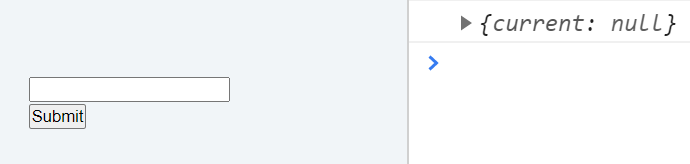
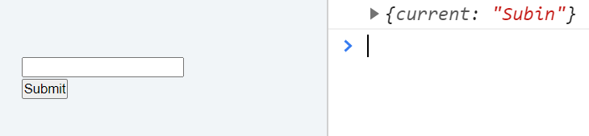
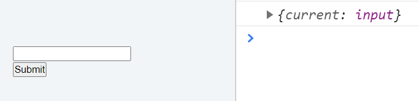
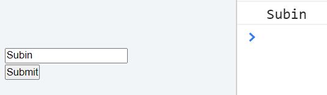
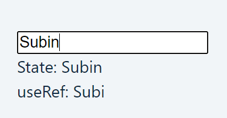

<div className="posts-wrapper">

  The next hook we are going to learn about is useRef hook. This hook makes it possible to access DOM nodes/elements directly within functional components.

  <div class="blockquote">
  EDIT:
    Added "forwardRef" concept explanation
  </div>

  ## Three reasons for using useRef hook:

  <br/>

  - Preserves previous state values

  - DOES NOT trigger re-render unlike useState while updating

  - Targets DOM noes/elements

  Let's see how to use it.

  Import useRef hook like we did for useState, useEffect.

  ```jsx
  import React, { useRef } from "react";
  ```

  <br/>

  In this example, we will create a text input with Submit button and while clicking the button, the value entered in the input dialog will be logged out.

  ```jsx
  return (
    <>
      <form>
        <input type="text" />
        <button type="submit" onClick={handleSubmit}>
          Submit
        </button>
      </form>
    </>
  );
  ```

  <br/>

  Now it's time to introduce the big boy !!! 
  As said initially, the main usecase of useRef hook is targetting DOM nodes/elements and while updating the value, react won't re-render the component unlike useState.

  Like useState, for useRef we will declare a vairable and assign initial value for it.

  ```jsx
  const refContainer = useRef(null);

  console.log(refContainer)
  ```

  <br/>

  So now refContainer is assigned useRef hook with null value. Let's log out the variable in console and see.

  

  <br/>

  The refContainer returns an object with initial value passed to it. You can also pass inital value as some string to the input field. Let's try that.

  ```jsx
  const refContainer = useRef("Subin");

  console.log(refContainer)
  ```

  <br/>

  

  <br/>

  OK. So you understood this part of initialization in useRef I believe.
  Next we will target DOM element (in this case, input element).

  ```jsx
  const refContainer = useRef(null);
  const handleSubmit = (e) => {
    console.log(refContainer);
    e.preventDefault();
  };

  <input type="text" ref={refContainer}/>
  // button onClick handler => handleSubmit
  ```

  <br/>

  To target the DOM node, you need to provide reserved "ref" keyword in that element like we did above in input element, so that useRef hook knows which element to target and pass the initialized ref variable (in this case, refContainer).
  
  The console will output the DOM node in which ref keyword is initialized as below.

  

  <br/>

  We will try to access the value of what we typed in the input field by accessing the "current" property inside the object and log it out.

  ```jsx
  const handleSubmit = (e) => {
    console.log(refContainer.current.value);
  };
  ```

  <br/>

  

  <br/>

  One useCase of useRef is:
  Every time we render something, say we have useState, useEffect used in our project, so everytime useEffect hook renders on state update, we will update the ref value in input field by adding focus method.

  ```jsx
  useEffect(()=> {
    refContainer.current.focus();
  })
  ```

  <br/>

  <div class="blockquote">
  USEREF IS NOT A REPLACEMENT TO USESTATE. UseRef is mainly used for referring/accessing the DOM elements and update it without re-rendering the component.
  </div>

  <br/>

  ## Storing previous state values
  
  <br/>

  In this example we will try to initialize and update the state. While updating the state we will also print out the previous state value through useRef.

  ```jsx
  const prevName = useRef(null);
  const [name, setName] = useState("");

  useEffect(()=> {
    prevName.current = name;
  },[name])

  return (
    <>
      <input type="text" onChange={(e) => setName(e.target.value)} />
      <div>State: {name}</div>
      <div>useRef: {prevName.current}</div>
    </>
  )
  ```

  <br/>

  

  By this way, if we type "Subin", the previous state value which we logged out using useRef will be "Subi". The same way can be acheieved by using update state but it will cause the "component to re-render" which you can eliminate by using ref.

  ## How to pass ref to another component ?

  <br/>

  Let's say we have an input element in one component and the submit button in another component, the normal way of targetting DOM element (input field) is not possible as input and submit button lives in different components.

  For that React has provided us with another resource called "forwardRef", which makes the above situtaion possible.

  ### Official Definition in Reactjs.org:

  <br/>

  <div class="blockquote">
    Ref forwarding is a technique for automatically passing a "ref" through a component to one of its children.
  </div>

  ### App.js (parent component):

  <br/>

  ```jsx
  const refContainer = useRef(null);
  const handleSubmit = () => {
    refContainer.current.focus();
  };

  return (
    <div>
      <Input ref={refContainer} />
      <button type="submit" onClick={handleSubmit}>
        Submit
      </button>
    </div>
  )
  ```

  <br/>

  There is no difference here, since we initialized useRef variable and assigned null. Then referenced the variable in Input component which we are going to create in a minute. And handleSubmit handler.

  ### Input.js (child component)

  <br/>

  ```jsx
  const Input = React.forwardRef((props, ref) => {
    return (
      <div>
        <input type="text" ref={ref} />
      </div>
    );
  }
  ```

  <br/>

  You may notice the "React.forwardRef()" function which receives arguments, props and ref. Pass the ref prop to input text field with "ref" keyword. 
  
  JOB DONE !!

  That's all about useRef hook, hope you understood the difference between useState and useRef and how to use ref in another component. Happy learning !!

</div>
