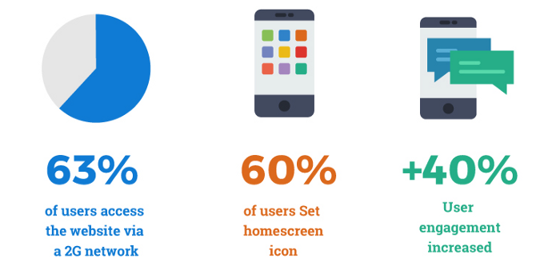

<div className="posts-wrapper">


Today's post is about one of the most trending topic in the web development industry, and it's none other than PROGRESSIVE WEB APPS, where we will be explaining the PWA concept and their advantages over native mobile apps. And in the next posts, we will be covering about building the progressive web app using HTML, CSS and Vanilla JavaScript.

In this posts, we will look into What are Progressive Web Apps and how its beneficial.

Each and every company is working on to implement Progressive Web App functionality in their website which will increase the traffic and engagement of customers to stay as long as possible in their website. THIS IS WHAT THE MOTTO OF PWA.

Our agenda in today's post:

1. What are Progressive Web apps

2. Advantages of PWA over native mobile apps

3. How service worker contributes to PWA

4. Business Websites that have implemented PWA

5. Conclusion

<hr/>
===============
## What are Progressive Web Apps
<br/>

Okay.. We will first look into, what are progressive web apps aka PWA.

Have you guys ever imagined a world where you don’t need to install an app from the play store for accessing an informational or shopping website like Amazon or Flipkart ? Progressive Web Apps help you achieve this by providing a seamless, app-like experience when you open a website on a mobile device.

### Definition
<br/>

An application that is built and lives on the web which behaves similar like native mobile application. Sort of hybrid app. Looks like a mobile app which lives in the web.
As simple as that. I haven't used any jargon words in this, just easy peasy.

You would have noticed one thing in my statement that "app that is built and lives on the web". That is strange right ?
Before PWA, it is not possible to build an app in the web, rather we will be using some SDK like Flutter or React Native and what we will do is we will launch it in app store or play store. This is the normal procedure, right ?.

But not in Progressive web app era.

We can build it in the web and we can launch it in the web also at zero cost. Yes its free with no strings attached.


<hr/>
<br/>


## Advantages of PWA over native mobile apps
<br/>

Okay. So far we got to know about what is meant by progressive web app. Atleast u would have got some idea on this.

Now let's see the features PWA is providing.

### Cost efficient
<br/>


If you are like me, I don't wanna waste my time trying to code the app in two different languages and launch it in two different app markets costing upto 25$ of one time fee charged by Google and 99$ per year for uploading the app into App store / iOS Store. Why we need to spend this much amount on building just one app where in an alternate world you can build it easily using PWA.

PWA is browser compatible. You can view the same PWA app in Safari browser or  Chrome or even UC browser. I dont think who even uses UC browser. Its like internet explorer loaded with bloatware.


### Less burden for developers
<br/>

Also if you are like me... Technically I am a JavaScript developer and I don't want to learn Java as you guys would know that Java is the ugliest language in the world that's why Jetbrains developed kotlin to build android apps or u have to learn swift language for developing iOS apps or to learn flutter which is nothing but a SDK which uses Dart programming language to develop cross platform apps, where you can build both store apps. I don't wanna learn everything to build just an app. I know JavaScript and with PWA combined i believe i can rule this world.


### No need to worry about updates
<br/>



Also another major feature is the update process. In mobile apps, you will be receiving updates via playstore and that too the size will be of 20-30 MB and if you are in rural area downloading 20-30 MB with the 2G/3G connection is a pain in the ass.
But in PWA everything will be done by the developer at the backend. We don't have to worry about the update process. If you launch the application, the updated site will be shown. That's it. Clean and easy.


### Storage Size
<br/>

Most of them would be facing this warning "Please uninstall apps to continue" in your mobile due to lack of space to install new apps. But PWA enabled app won't face this kind of issue, because of the storage size of the app. The PWA is lesser than 600KB over the wire vs 30-100MB of downloaded data needed to install the native Android app.


### Offline working mode
<br/>


Last but not the least, the major feature of PWA is its offline working mode.
There is a seperate section called service worker which is a core technology used in Progressive web applications. Service workers are nothing but a script which runs in the background and takes care of the offline management and push notifications to the mobile screen even when the app is not running in the background.

The primary purpose of Service Workers are to act as an caching agent, to handle network requests and to store content for offline use, and secondly to handle push messaging.

<hr/>
<br/>

## How service worker contributes to PWA
<br/>


Service Worker Architecture:


A Service Worker sits between Client / browser and the Server. A JS script which gets registered with the browser and stays registered even when browser is closed or in offline. Usually, when you enter a URL in your browser (GET request), the remote server returns the information of that site in return as a HTML web page. But when you have a service worker registered, it basically adds an another step to the process.

The Service Worker adds in the middle where it can intercept the requests and decide what should happen, whether it should show the remote version or showing an offline version. This can prevent from displaying the default ugly dinosaur page when internet goes down. So we can design custom offline pages for fun.

Because of the power of a service worker, and to prevent man-in-the-middle attacks where third parties track the content of the user's communication with the server, service workers are only available on secure origins serve through TLS, using the HTTPS protocol. Localhost are exempt by default from this policy. 
By the way if you're hosting code in GitHub, you can use GitHub Pages. They're provisioned with SSL certificate by default.

Services like _Let's Encrypt_ allow you to procure SSL certificates for free to install on your server. Service workers allows you to cache content and improve performance of your application. Caching your assets for your application will make your content load faster under a variety of network conditions.

Two specific types of caching behavior are suitable for use are available through service workers.

* Pre-cache assets -  Caching the files during installation, like HTML, CSS, JavaScript, images and so on. These are shared across your application you can cache them when you first install service worker when your web app is first opened.

* Offline cache loading - This type of cache provides a fallback for offline access. Using FETCH API inside a service worker, we can fetch requests and modify response with content other than object requested. Use this technique to provide alternative resources in case the requested resources are not available in cache and the network is unreachable. 


### Service Worker Life Cycle
<br/>

A service worker must be registered by a website. Because some browsers still don't support service workers you should perform a feature check before registering a service worker. This is done by checking for the presence of serviceWorker in navigator.

```javascript
  if ('serviceWorker' in navigator) { 
    navigator.serviceWorker.register('/sw.js')
    .then(function(registration) { 
      // Registration was successful 
    })
    .catch(function(err) { 
      // registration failed
    }); 
  }
```

To register the service worker call navigator.serviceWorker.register. Indicate the service worker file to register function where it returns a promise.

If successful the promise returns a reference to the service worker registration object. From there you can perform specific UI tasks as needed.

Service Worker Lifecycle:

* Register

* Install

* Activate

The install event is only triggered once in a service worker's life time. The event will not trigger again until the service worker is updated.

The more about Service worker registration and updating the cache pages will be done in the next post where we will be building a PWA application from start to finish.

<hr/>
<br/>

## Business that have implemented PWA
<br/>

Many leading businesses, including Starbucks, The Financial Times, and Pinterest, have built PWAs and reported a considerable increase in user engagement. PWA technologies can help companies gain up to 12x more users. Here we will see some of the successful PWA examples that will inspire you to build one for your business.

Dozens of major brands have reinforced their mobile efforts and released PWAs. Some of the most powerful examples of PWAs include those used by media companies, platforms for social news-sharing, travel services, and e-commerce solutions. 


<hr/>
<br/>

## Conclusion
<br/>

Okay. We looked into the major features and advantages of PWA over native mobile apps. Due to the major reasons such as cost effectiveness and engagement of customers in the website, business have been forced to implement progressive web applications because of the heavy competition in the outside world.


</div>