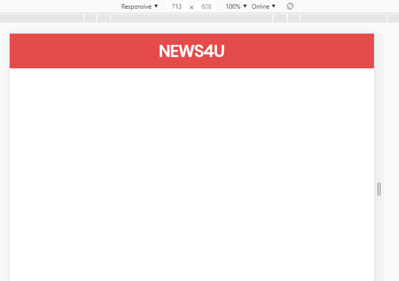
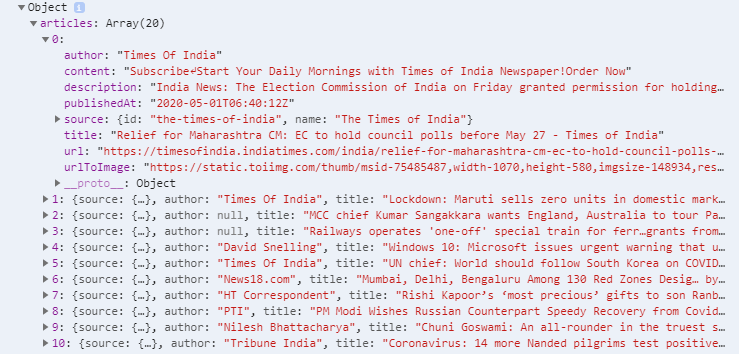
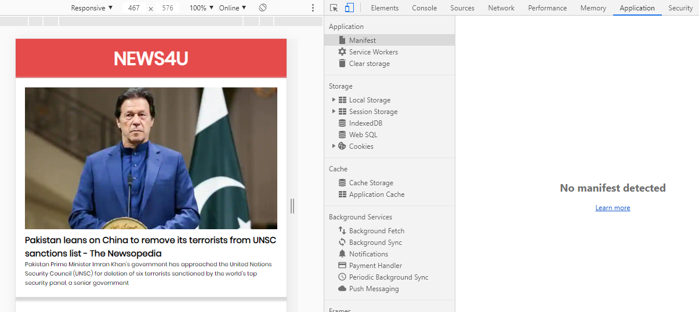
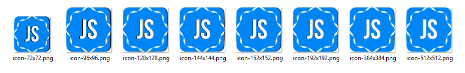
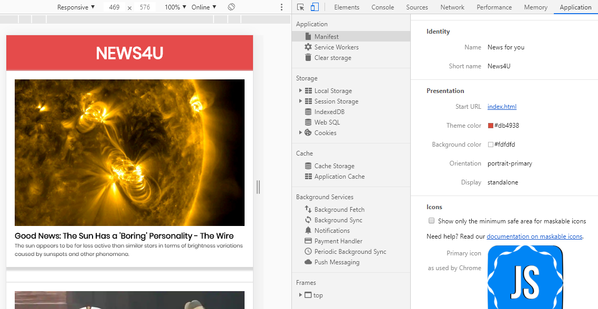
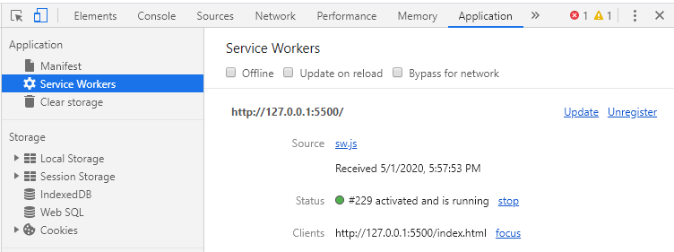

<div className="posts-wrapper">

In this post we will see, how to build a progressive web app with offline functionality using HTML, CSS and vanilla JavaScript for beginners.

This post is a continuation of previous post "Should you implement PWA in your Website", where we saw what are progressive web apps and the advantages of it over native mobile apps. Also we looked on the architecture of service workers and how it provides seamless network connection even when network is bad. How caching works and business websites that have implemented this technology and many more.

Have a look at the previous post to get a good grasp of the essentials of PWA.

<div className="post-recommendation">

<span className="previous-post">You might also like: </span><a href="https://www.javascriptwillrule.com/should-you-implement-pwa-in-your-website" target="_blank" aria-label="pwa explained blog post link"> Should you implement PWA in your website</a>

</div>

In this PWA project, we will be building a PWA implemented news website.

First, we have to build our traditional web app. So let's start with the markup.

HTML (index.html):
================

I use EMMET (who even not) for generating HTML boilerplate and have added Poppins font from Google font and two external files, a CSS and JS file. The defer keyword in the JS script import is to tell the browser to go process the HTML CSS and load the script files in the background, which will save time and decrease the _first page interact speed_. 
The empty main section is where the news api results will be embedded.

```html
<!DOCTYPE html>
<html lang="en">

<head>
  <meta charset="UTF-8">
  <meta name="viewport" content="width=device-width, initial-scale=1.0">
  <title>PWA website</title>
  <link href="https://fonts.googleapis.com/css?family=Poppins&display=swap" rel="stylesheet">
  <link rel="stylesheet" href="styles.css">
  <script src="news.js" defer></script>
</head>

<body>
  <div class="container">
    <header>
      <h1>News4U</h1>
    </header>

    <main></main>
  </div>
</body>

</html>
```

<br/>

CSS (Styles.css):
================

We will not complicate the CSS part, as we have much more to go on implementing PWA.
We will have a navbar of _min-height 60px_ with logo centered. And the main section will hold the news cards.

```css
  * {
  margin: 0;
  padding: 0;
  box-sizing: border-box;
}
body {
  font-family: 'Poppins';
}

header {
  width: 100%;
  height: auto;
  min-height: 60px;
  background: #E54B4B;
  padding: 10px;
}

h1 {
  color: #fff;
  text-align: center;
  text-transform: uppercase;
}
```

So far, this is how our web page looks like:



Now let's concentrate on JavaScript part. 

<br/>

Fetch data with JavaScript (news.js):
====================

We will get the main section where we will post the news articles and also before that try to create a new account and generate API key from <https://newsapi.org>. The NewsAPI is a simple HTTP REST API for searching and retrieving live articles from all over the web.

* What top stories is the NY Times running right now?

* What new articles were published about the next iPhone today?

* Has my company or product been mentioned or reviewed by any blogs recently?

In our example, we will fetch the top headlines of over every news magazine pages in country India (country customizable), provided by NEWSAPI.

```javascript
  const apiKey = 'YOUR_API_KEY';

  let url = `https://newsapi.org/v2/top-headlines?country=in&apiKey=${apiKey}`;

  const main = document.querySelector('main');
```
<br/>

Now let's use Fetch API where the news articles will be loaded on to the webpage once DOM is loaded. _postNews_ function will be triggered every time the webpage is opened or re-loaded.

We will async/await to perform asynchronous loading of resources in the background and where we have to use await while fetching, which will wait for the results to fetch. We will assign it to a variable and to access it change it in JSON format.

```javascript

  window.addEventListener('load', e => {
    postNews();
  }); 

  async function postNews() {
    const res = await fetch(url);
    const data = await res.json();
    console.log(data);
  }
```

On logging the JSON data, this is how the response will be like:



Now we'll loop over the response data and will create news articles in card structure. Loop over the response JSON and it will be embedded into the main element.

```javascript
  async function postNews() {
    const res = await fetch(url);
    const data = await res.json();
    main.innerHTML = data.articles.map(createArticle).join('\n');
}
```
<br/>

With this code above, we can now loop through the array and show them on the HTML file. And to make everything work, we wait until the DOM (Document Object Model) content finishes loading to run the createArticle method.

createArticle function:

```javascript
  function createArticle(article) {
    return `
      <div class="article">
        <a href="${article.url}" target="_blank">
          
          <h2>${article.title}</h2>
          <p>${article.description}</p>
        </a>
      </div>
    `
}
```
<br/>

We will look into the styling part of the article section. CSS grid is used for responsive mobile navigation.
We'll have several cards, so for the container element it will be displayed as a grid. And, with grid-template-columns: repeat(auto-fit, minmax(300px, 1fr)), we can now make our cards responsive so that they use at least 300px width if there is enough space (and 1fr if not).

And to make them look nice we double the shadow effect on the .article class and a little bit of padding to look much more smoother.

```css
  main {
  display: grid;
  grid-gap: 30px;
  grid-template-columns: repeat(auto-fit, minmax(300px, 1fr));
  grid-auto-rows: max-content;
  grid-auto-flow: row dense;
}

.article {
  padding: 1rem;
  box-shadow: 3px 3px 3px 4px rgb(216, 216, 216);
}

.article img {
  width: 100%;
}

.article a,
.article a:visited {
  text-decoration: none;
  color: inherit;
  font-size: 10px;
}
```
<br/>

Okay, we have finished the markup, styling and API fetching logic. This is how our webpage looks as of now:


We've done a lot, but for now, we just have a traditional web app. So, let's change that in the next section by introducing some PWA features.

So you can see from the image below, that we haven't added any features to this web app. For that, navigate to Developer Tools -> Application -> Manifest



Web App Manifest file:
=====================

Web Manifest file is the starting place for implementing Progressive Web App. It is a JSON file which contains the information about your web app. Also it tells the browser how to behave on client mobile/tablet device.And to show the Add to Home Screen prompt, the web app manifest is required. PWA manifests include its name, author, icon(s), version, description, and list of all the necessary resources

Now that we know what a web manifest is, let's create a new file named manifest.json in the root directory. Then add this code block below.

### Mainfest.json
<br/>


```json
{
  "name": "News4U",
  "short_name": "News4U",
  "start_url": "index.html",
  "display": "standalone",
  "background_color": "#fdfdfd",
  "description": "A simply readable News app.",
  "theme_color": "#db4938",
  "orientation": "portrait-primary",
  "icons": [
    {
      "src": "/images/icons/icon-72x72.png",
      "type": "image/png",
      "sizes": "72x72"
    },
    {
      "src": "/images/icons/icon-96x96.png",
      "type": "image/png",
      "sizes": "96x96"
    },
    {
      "src": "/images/icons/icon-128x128.png",
      "type": "image/png",
      "sizes": "128x128"
    },
    {
      "src": "/images/icons/icon-144x144.png",
      "type": "image/png",
      "sizes": "144x144"
    },
    {
      "src": "/images/icons/icon-152x152.png",
      "type": "image/png",
      "sizes": "152x152"
    },
    {
      "src": "/images/icons/icon-192x192.png",
      "type": "image/png",
      "sizes": "192x192"
    },
    {
      "src": "/images/icons/icon-384x384.png",
      "type": "image/png",
      "sizes": "384x384"
    },
    {
      "src": "/images/icons/icon-512x512.png",
      "type": "image/png",
      "sizes": "512x512"
    }
  ]
}
```

Once the manifest file has been added to the root directory, we have to link it with the index.html page as link element.

In index.html:

```html
<link rel="manifest" href="manifest.json">
```
<br/>

### Properties added in JSON file:

<br/>

* name: When the browser launches, user will be shown a splash screen and the name of the web app.

* short_name: App name in your mobile device.

* start_url: Page shown to the user when the app is launched.

* display: It tells the browser how to display the app. There are several modes like minimal-ui, fullscreen, browser etc. Here, we use the standalone mode, so that you don't see the browser bar/address bar and chrome browser header.

* background_color: When the browser launches the splash screen, it will be the background of the screen.

* description: This will be helpful for search engines to track your app in search results.

* theme_color: It will be the background color of the status bar when we open the app.

* orientation: It tells the browser the orientation to have when displaying the app. Default is Portrait.

* icons: When the browser launches the splash screen, it will be the icon displayed on the screen. Here, I used all sizes to fit any device's preferred icon. But you can just use one or two. Also if you don't want to spend time creating individual app icons, then you can use <https://app-manifest.firebaseapp.com/>, where you can upload a 512x512 PNG image which will create 8 types of size icons for you.



Now the setting up of manifest file is over, let's see what the manifest section in developer tools shows:



Pretty much implementation setup is over. Notice that PWAs run only on https because the service worker can access the request and handle it. Inorder to avoid hackers to sniff the data that is passed over the cache memory through service worker, HTTPS security is required.

### Service Worker (sw.js):

Create a sw.js (service worker) file in root directory as like manifest.json. Once created, in ```news.js``` try to register the service worker in a common page, where user will be able to access service worker features. Because when the user directly directs to <https://javascriptwillrule.com/about> rather than homepage, it should still work. For that,

In _news.js_

We will register the service worker file.

```javascript
  navigator.serviceWorker.register('/sw.js');
```

_navigator_ represents 'Browser'.

This will register the service worker file, but however in some browsers it will throw an error, because of the service worker functionality/object will not be there. So what we should do is wrap the above code with IF statement, to check for service worker object.
If not supported, then no worries, service worker wont get registered and normal traditional web app will be shown.

Wrap the above code like below:

```javascript
  if('serviceWorker' in navigator) {
    navigator.serviceWorker.register('/sw.js');
  }
```

Also the service worker register method returns a promise.

```javascript
  if('serviceWorker' in navigator) {
    navigator.serviceWorker.register('/sw.js');
      .then(function() {
        console.log('Service Worker registered');
      })
  }
```
<br/>



Now we will Install and Activate Service Worker:

_In sw.js_

```javascript
self.addEventListener('install', ()=> {
  console.log('SW Installed');
});

self.addEventListener('activate', ()=> {
  console.log('SW Activated');
})
```
_self_ represents service worker object itself.

Now the we have installed and activated the service worker. The next part is about pre-caching the assets. The pre-caching means files that you know that will not change often and always want the user to access them. And the best place for that is in the _install_ event, pre-caching static assets.

This static assets caching can be done by accessing the special Web API which allows us to access the cache, not the default browser cache.

In sw.js:

```javascript

const staticAssets = [
  './',
  './index.html',
  './styles.css',
  './news.js'
];

self.addEventListener('install', async event => {
  const cache = await caches.open('news-assets');
  cache.addAll('staticAssets');
});
```

In the above code, what we have done is, we have listed out the static assets that have to be cached. And we create new cache memory and use _addAll_ method to add the static assets to it.

Now if you navigate to Developer Tools -> Application -> Cache Storage. Your newly created cache will be listed out with all the static assets listed. But now if you try to load your webpage with Offline mode, it won't work because we have to fetch the static assets and process. The service worker is a low level API, we have to command it to do it. 

Let's add a fetch event.

```javascript
  self.addEventListener('fetch', event => {
    const req = event.request;
    event.respondWith(cacheFirst(req));
  });
```

Fetch event is the event which will be sent from our application to the network. First we will get the request by _event.reqest_ and respond it with cache assets first, which is a function.

```javascript
  async function cacheFirst(req) {
    const cachedResponse = await caches.match(req);
    return cachedResponse || fetch(req);
  }
```

cacheFirst function matches the request and return the response and specific response is not there, then the FETCH API will trigger request to network.

Now if you view in Offline mode, the header section will only be displayed. We have successfully cached the static files. 
Now we will cache the news articles also, if suppose there is no network we will post the last cached news articles to the webpage.

```javascript
  self.addEventListener('fetch', event => {
    const req = event.request;
    const url = new URL(req.url);

    if(url.origin === location.origin) {
      event.respondWith(cacheFirst(req));
    }else {
      event.respondWith(networkFirst(req));
    }
    
  });
```

Here we are checking if the URL is equal to the fetching location, if cache then fetch from it or else fetch from network.

```javascript
  async function networkFirst(req) {
    const cache = await caches.open('news-articles');

    try {
      const res = await fetch(req);
      cache.put(req, res.clone());
      return res;
    } catch(error) {
      return await cache.match(req);
    }
  }
```

Here we are creating new seperate cache for news articles to get stored. First in try block, we are trying to fetch the request from the network. If that worked, we have to store the response in cache (news articles) so that we can have fallback.

We are going to save the article by PUT method with key and value pair as request and the response. We are cloning the actual result here. Then returning the response. If that fails (no network), we are going to cache and match the request and return the result in the cache.

Now the articles will get stored sucessfully. We have implemented the service worker functionality in our web application.

</div>