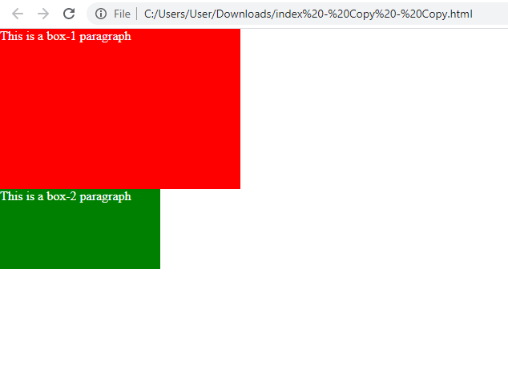
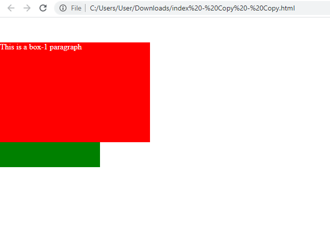
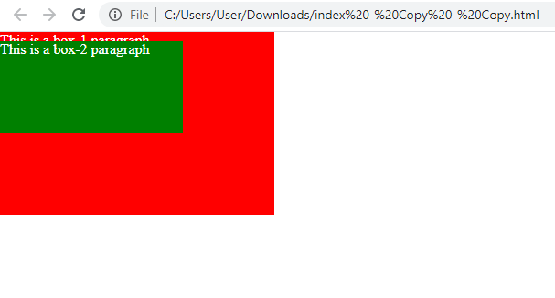
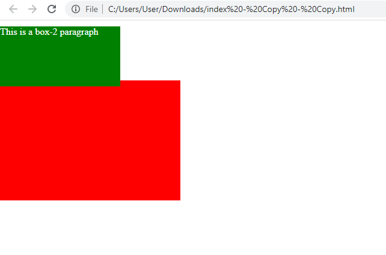
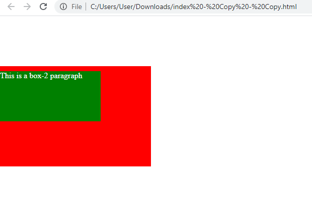

<div className="posts-wrapper">

Welcome to my CSS playlists, where we will be covering all CSS(mmmm...most of it), tough or would say tricky topics to understand. In this posts, we will not only explain the concept, but also build a mini project with what we learned to get the understanding clear.

In our list the first place goes to CSS positioning. Without further ado, let's get into the explanation part.

### Definition:
<br/>

The _Position_ property can help you place the content wherever you like (you can manipulate the element) with respect to the parent element.

The two main giants in the positioning world are:

* Relative

* Absolute

## <u>Relative Positioning</u>:
<br/>

A relative positioned element is positioned relative to its normal position.

In the relative positioning property the element's box position is calculated according to the normal flow. Then the box is shifted from this normal position according to the properties — _top_ or _bottom_ and/or _left_ or _right_.

For Eg:

In the below code snippet, i have 2 div blocks of classes _box-1 & box-2_ and some basic styling for those.

In index.html:

```html
<div class="box-1">This is a box-1 paragraph</div>
<div class="box-2">This is a box-2 paragraph</div>
```
<br/>

In styles.css:

```css
* {
  margin:0;
  padding:0;
  color:#fff;
}

.box-1 {
  width:300px;
  height:200px;
  background-color:red;
}

.box-2 {
  width:200px;
  height:100px;
  background-color:green;
}
```

Output:



As you can see, normally the positioning of the div elements go with the normal flow of the document, in background if you look upon the positioning property of the body element it's _position: static_. You don’t necessarily need to call out static positioning, as it’s the default for every HTML element.

If you give _position: relative_ to the _box-1_ class, then the element's box position is calculated according to the normal flow. Then the box can be shifted from its normal position to somewhere you like with properties -- _top_ or _bottom_ and / or _left_ or _right_.

In styles.css:

```css
.box-1 {
  position:relative;
  top:50px;
}
```

In the above class, we have added relative positioning to the _box-1_ class with property _top_ of 50px which will push down the box to 50px.

Output:



<div className="blockquote">

As you see, from the above output, the box-1 element moved downwards 50px without affecting the other element (box-2) down there. It will take the current position as the start position to translate. *This is the main advantage of the relative positioning that the other elements position be affected.*

</div>

<br/>
<hr/>
<br/>

## <u>Absolute Positioning</u>:
<br/>

An absolutely positioned element is positioned relative to the first parent element. If there are no parent element found, it will incharge the parent as the browser window, aligning it as per the _top/left_ property.

Unlike relatively positioned element, the div elements won't have normal flow when it is assigned _position: absolute_. Like, it will be pulled out from the normal flow and will be placed on top of everything.

In styles.css:

```css
.box-2 {
  position: absolute;
  top: 10px;
}
```

I removed the _position: relative_ in box-1 element and added absolute positioning class in box-2 element. So it's clear that there is no parent element that has the property absolute. Let's see how it behaves.



As you can see, it took the browser as parent and aligned it towards the top 10px.

<div className="blockquote">

The bad part of absolute positioning is that it disturbs other elements that are behind them. The other elements will get distorted and moved upwards if the before element is positioned absolute.

</div>

Now, the other case is, we will have a box-2 inside box-1 to see how it behaves.

In index.html:

```html
<div class="box-1">
  <div class="box-2">This is a box-2 paragraph</div>
</div>
```

In styles.css:

```css
.box-1 {
  margin-top: 100px;
}

.box-2 {
  position: absolute;
  top: 10px;
}
```
In the above code snippet, we can see that the box-1 is the parent of box-2. Hence the box-2 which is positioned absolutely will check for whether the parent element is positioned relatively so that it can take it as a reference and move accordingly. But in this case, it's not. So it will adopt browser as its parent. Ouput below.

Output:

Box-2 aligned with respect to browser with top 10px.



Now i will assign box-1 element as parent of box-2 and see what happens.

In styles.css:

```css
.box-1 {
  margin-top: 100px;
  position:relative;
}

.box-2 {
  position:absolute;
}
```
<br/>



Now the box-2 will be moved with respect to the position of box-1 because of the post it has, PARENT.
I think now you got your understanding clear on how to lay out the elements position in workspace. Hope you learnt something and enjoyed it!

<hr/>
<br/>

The best way to understand the CSS Position Property is by practice. Keep coding until you have a better understanding. Hands-on experience with the techniques will help you understand them more thoroughly.

If you want to learn more about front end web development, feel free to follow me on [Youtube channel link](https://www.youtube.com/channel/UCuE_9lHb0a3GmkGvcjJK1GA)

Thank you for reading!

</div>