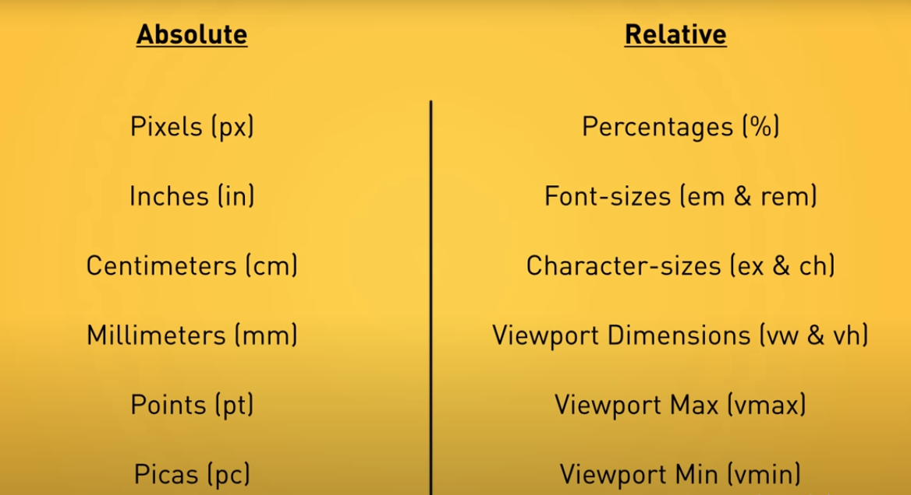
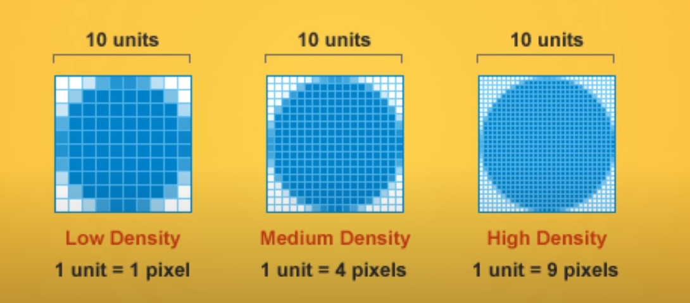
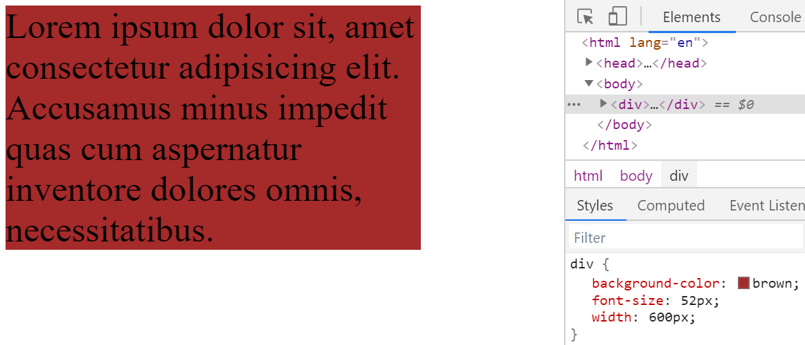
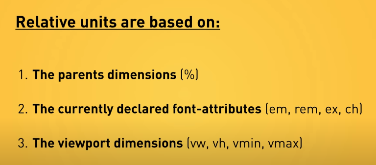

<div className="posts-wrapper">

In this posts, we will look into CSS Units where we will be learning when and where to use _em, px, rem and %_.

### Definition:
<br/>

CSS Units are measurement units which we will be using to denote the length or size of an element in stylesheet like _padding:”5px”_.
CSS Units can be measured in two ways:

* Absolute lengths

* Relative lengths




We will first look into the Absolute measurement units with examples and will conclude on how effective or in-effective they are based on that.

Let's get started.

## <u>Absolute CSS Units</u>
<br/>

Why it's called Absolute lengths? Simple! It is independent of any element or block.It doesn't care what size it's parent are. It's good to not depend on anyone, unless you are working with a team. In web development industry we are. It is not good for use on screen, because screen sizes vary too much depending on the device used for that page. 

It can be used at the place where the output medium is known like in a wedding invitation/gift card, where you will be issuing it to your friends/relatives at only one format.

## What is a Pixel ?
<br/>

The CSS specification says,

<div className="blockquote">

  “The reference pixel is the visual angle of one pixel on a device with a pixel density of 96dpi and a distance from the reader of an arm’s length. For a nominal arm’s length of 28 inches, the visual angle is therefore about 0.0213 degrees. For reading at arm’s length, 1px thus corresponds to about 0.26 mm (1/96 inch). ”

</div>

Pixels eventhough they are absolute dimensions, they are not based on the viewport width or the another font size. They are best thought as device pixels. You know the size of the pixel can vary depending on your device.



The major issue with the pixel measurement as i said above is the number of lines of code will get increased when we write media queries for making the website responsive.

Code example below:

```html
<body>
  <div>
    Lorem ipsum dolor sit, amet consectetur adipisicing elit. Accusamus minus impedit quas cum aspernatur inventore
    dolores omnis, necessitatibus.
  </div>
</body>
```

<br/>
<br/>

```css
html {
  font-size: 16px;
}

div {
  background-color: brown;
  font-size: 52px;
  width: 600px;
}
```

As you can see from the above example, eventhough we added the base pixel as 16px, it doesn't care for that, it is still 52px.

An absolute unit therefore isn’t ideal if we are trying to create a fluid grid for a responsive design.



It does affect the accessibility in the performance testing of the website. For readers of older age people or people with eyesight issues feel difficult to cope up with the font-sizes in the screen.

However it can be used for using borders. They won't get changed based on the screen sizes. Other than that, not preferred to use.

## Inches, Centimeters etc
<br/>

Those are physical measurement values, not used in the web development industry much. However in the printing press indutry they are widely used for paper output medium. As i said earlier, for fixed output medium, it's better to use absolute measurement units.

```css
h1 { margin: 0.5in; }       /* inches, 1in = 96px = 2.54cm  */
h2 { line-height: 3cm; }    /* centimeters */
h3 { word-spacing: 4mm; }   /* millimeters */
h4 { font-size: 12pt; }     /* points, 1pt = 1/72 of 1in */
h5 { font-size: 1pc; }      /* picas, 1pc = 12 pt */
```

<br/>

## <u>Relative CSS Units</u>

<br/>

Relative Units are the CSS units which we will be widely using without knowing the major advantage it's providing. Relative units depend on either the immediate parent (like _em_) or dependent on the html base font (like _rem_).



## Percentage (%)
<br/>

This is best for assigning the width of the element. Say, you are assigning an element with width 90%, then the width of the element in the devices like mobile, tablet and laptops/high-resolution display will be 90% of the viewport width.

And if i have a child element (parent is above said element of width 90%) of width 50%, then the width of the child element will be 50% width of the parent element, i.e.., 45%. It won't take the width of the viewport.

<div className="blockquote">

Percentage units are a key component in the flexible grids needed for responsive design.

</div>

```html
<div class="parent-div">
  <p>This div is 90% of width</p>
  <div class="child-div">
    <p>The nested div is set to 50%. This makes it 50% of its direct parent.</p>
  </div>
</div>
```

<br/>
<br/>

```css
.parent-div {
  width: 90%;
}

.parent-div .child-div {
  width: 50%;
}
```
<br/>

## rem

<br/>

The rem (root em) unit is the font-size of the root element, which is usually the _html_ element. As with em, you can use this value as a length unit and it will always remain relative to the root element. No nesting issues, where we will be facing this as the em units take the font-size base values from the parent element. rem only gets the base values from the _html_ element.

This is the best CSS Relative unit to declare for font sizes to bring responsiveness under the different device conditions.

```html
<div>
  Lorem ipsum dolor sit, amet consectetur adipisicing elit. Accusamus minus impedit quas cum aspernatur inventore dolores omnis, necessitatibus.
</div>
```

For this i am going to declare base font size as 1rem for standard laptop device. However, for device like mobile, the font-size should be slightly larger in size. The usual tackling CSS is like below:

```css
html {
  font-size: 1rem;
}

div {
  background-color: brown;
  font-size: 2rem;
  width: 600px;
}
```
<br/>

However, if you want to change the font-size of all the elements (in our case there is only one div), then we will be writing media queries for each and every element and changing its font sizes to say, 2rem. 

Rather the easiest approach is one to change the html base font size to 2rem. That's all. Everything will be as good as you wrote 20 lines of CSS media queries to make it better.

</div>