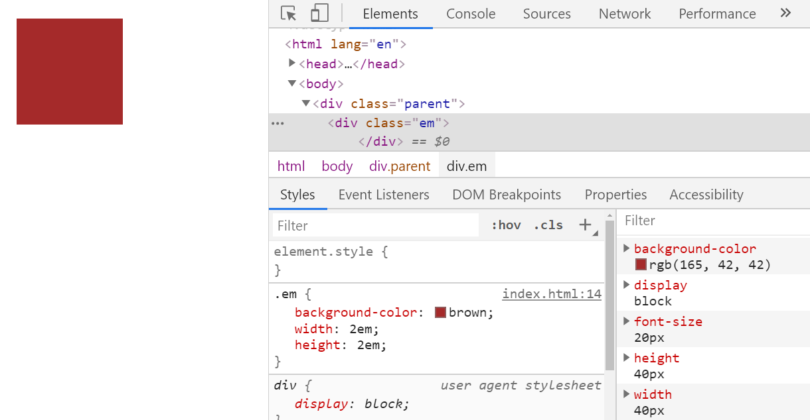
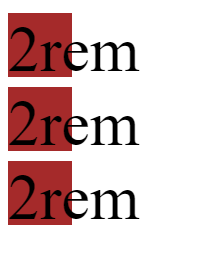

<div className="posts-wrapper">

Welcome to my second posts on CSS units in CSS playlists section.
In this posts, we will look into CSS measurement units where we will be learning where, when and how to use _em, px, rem and %_.

### Definition:
<br/>

CSS Units are measurement units which we will be using to denote the length or size of an element in stylesheet like _padding:”5px”_.
CSS Units can be measured in two ways:

* Absolute lengths

* Relative lengths


We will first look into the Absolute measurement units with examples and will conclude on how effective or in-effective they are based on that.

Let's get started.

## <u>Absolute CSS Units</u>
<br/>

Why it's called Absolute lengths? Simple! It is independent of any element or block.It doesn't care what size it's parent are. It's good to not depend on anyone, unless you are working with a team. In web development industry we are. It is not good for use on screen, because screen sizes vary too much depending on the device used for that page. 

It can be used at the place where the output medium is known like in a wedding invitation/gift card, where you will be issuing it to your friends/relatives at only one format.

## What is a Pixel ?
<br/>

The CSS specification says,

<div className="blockquote">

  “The reference pixel is the visual angle of one pixel on a device with a pixel density of 96dpi and a distance from the reader of an arm’s length. For a nominal arm’s length of 28 inches, the visual angle is therefore about 0.0213 degrees. For reading at arm’s length, 1px thus corresponds to about 0.26 mm (1/96 inch). ”

</div>

Pixels eventhough they are absolute dimensions, they are not based on the viewport width or the another font size. They are best thought as device pixels. You know the size of the pixel can vary depending on your device.


The major issue with the pixel measurement as i said above is the number of lines of code will get increased when we write media queries for making the website responsive.

Code example below:

```html
<body>
  <div>
    Lorem ipsum dolor sit, amet consectetur adipisicing elit. Accusamus minus impedit quas cum aspernatur inventore
    dolores omnis, necessitatibus.
  </div>
</body>
```

<br/>
<br/>

```css
html {
  font-size: 16px;
}

div {
  background-color: brown;
  font-size: 52px;
  width: 600px;
}
```

As you can see from the above example, eventhough we added the base pixel as 16px, it doesn't care for that, it is still 52px.

An absolute unit therefore isn’t ideal if we are trying to create a fluid grid for a responsive design.


It does affect the accessibility in the performance testing of the website. For readers of older age people or people with eyesight issues feel difficult to cope up with the font-sizes in the screen.

However it can be used for using borders. They won't get changed based on the screen sizes. Other than that, not preferred to use.

## Inches, Centimeters etc
<br/>

Those are physical measurement values, not used in the web development industry much. However in the printing press indutry they are widely used for paper output medium. As i said earlier, for fixed output medium, it's better to use absolute measurement units.

```css
h1 { margin: 0.5in; }       /* inches, 1in = 96px = 2.54cm  */
h2 { line-height: 3cm; }    /* centimeters */
h3 { word-spacing: 4mm; }   /* millimeters */
h4 { font-size: 12pt; }     /* points, 1pt = 1/72 of 1in */
h5 { font-size: 1pc; }      /* picas, 1pc = 12 pt */
```

<br/>

## <u>Relative CSS Units</u>

<br/>

Relative Units are the CSS units which we will be widely using without knowing the major advantage it's providing. Relative units depend on either the immediate parent (like _em_) or dependent on the html base font (like _rem_).


## Percentage (%)
<br/>

This is best for assigning the width of the element. Say, you are assigning an element with width 90%, then the width of the element in the devices like mobile, tablet and laptops/high-resolution display will be 90% of the viewport width.

And if i have a child element (parent is above said element of width 90%) of width 50%, then the width of the child element will be 50% width of the parent element, i.e.., 45%. It won't take the width of the viewport.

<div className="blockquote">

Percentage units are a key component in the flexible grids needed for responsive design.

</div>

```html
<div class="parent-div">
  <p>This div is 90% of width</p>
  <div class="child-div">
    <p>The nested div is set to 50%. This makes it 50% of its direct parent.</p>
  </div>
</div>
```

<br/>
<br/>

```css
.parent-div {
  width: 90%;
}

.parent-div .child-div {
  width: 50%;
}
```
<br/>

## rem

<br/>

The rem (root em) unit is the font-size of the root element, which is usually the _html_ element. As with em, you can use this value as a length unit and it will always remain relative to the root element. No nesting issues, where we will be facing this as the em units take the font-size base values from the parent element. rem only gets the base values from the _html_ element.

This is the best CSS Relative unit to declare for font sizes to bring responsiveness under the different device conditions.

```html
<div>
  Lorem ipsum dolor sit, amet consectetur adipisicing elit. Accusamus minus impedit quas cum aspernatur inventore dolores omnis, necessitatibus.
</div>
```

For this i am going to declare base font size as 1rem for standard laptop device. However, for device like mobile, the font-size should be slightly larger in size. The usual tackling CSS is like below:

```css
html {
  font-size: 1rem;
}

div {
  background-color: brown;
  font-size: 2rem;
  width: 600px;
}
```
<br/>

However, if you want to change the font-size of all the elements (in our case there is only one div), then we will be writing media queries for each and every element and changing its font sizes to say, 1.5rem. 

Rather the easiest approach is one to change the html base font size to 1.5rem. That's all. Instead of writing 20 lines of mediaqueries for all elements, rem would make your life easier.

```css
html {
  font-size: 1rem;
}

div {
  background-color: brown;
  font-size: 2rem;
  width: 600px;
}

@media (max-width:480px) {
  html {
    font-size:1.5rem;
  }
}
```

<br/>

For the above code in device less than 480px wide, the font size for the _div_ block would be _1.5rem = 1.5 * 16px = 24px_.
<br/>


## em
<br/>

Using ems as a length unit in layout, and in particular in padding and margins can help to maintain a vertical rhythm. If a user resizes their text or you decide to make font sizes larger or smaller in your stylesheet, the em length unit will scale proportionately. In this example I am using ems for the padding on the box. The padding remains in proportion as I resize the font.

When em units are declared on child elements that don’t have a _font-size_ defined, they will inherit their _font-size_ from their parent, or from another ancestor element.

<div className="blockquote">

Use em when you specifically want the size of something to depend on the current font size.

</div>

Below example will make you clear on usage of em:

```html
<div class="parent">
  <div class="em">
  </div>
</div>
```
<br/>

```css
html {
  font-size:16px;
}

.parent {
  font-size:20px;
}

.em {
  background-color:brown;
  width:2em;
  height:2em;
}
```
<br/>

As you can see from the image below, the root font-size is taken from its parent and not from the _html_ root element like rem.

<br/>



<br/>

One interesting thing about _em_ is that they cascade. See the below example to understand it better.

```html
<div class="parent">
  <div class="em">2em
    <div class="em">2em
      <div class="em">2em

      </div>
    </div>
  </div>
</div>
```

<br/>

Same CSS , but to get the difference we will add the font-size property.
<br/>

```css
.parent {
  font-size: 20px;
}

.em {
  background-color: brown;
  width: 2em;
  height: 2em;
  font-size:2em;
}
```

<br/>


<br/>

This is called cascading feature that comes with _em_. Okay, let's break down the font-size of all 3 _em_ classes.

### First em:

font-size declared = 2em, parent font-size is 20px declared (in CSS). So 2 * 20px = 40px.

### Second em:

font-size declared = 2em, parent font-size is 40px (got from first em). So 2 * 40px = 80px.

### Third em:

font-size declared = 2em, parent font-size is 80px (got from second em). So 2 * 80px = 160px.

If you do this same thing to rem, it won't cascade, because it takes the parent font values from _html_ root element. Why just say, let's see that too in action.

```html
<div class="parent">
  <div class="rem">2rem
    <div class="rem">2rem
      <div class="rem">2rem

      </div>
    </div>
  </div>
</div>
```

<br/>

```css
.parent {
  font-size: 20px;
}

.rem {
  background-color: brown;
  width: 2rem;
  height: 2rem;
  font-size:2rem;
}
```

<br/>



<br/>

As you see in _rem_ there is no cascading involved. Both relative units has there own advantages and disadvantages. Please make sure you are using it wisely.

Hope i tried to break those intriguing parts simply for you guys. Let me know if you have any doubts.

<div className="blockquote">

Post your doubts in _subinsamrat96@gmail.com_. I will be there for you guys, always.
Thank you.

</div>

</div>