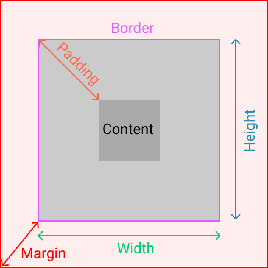
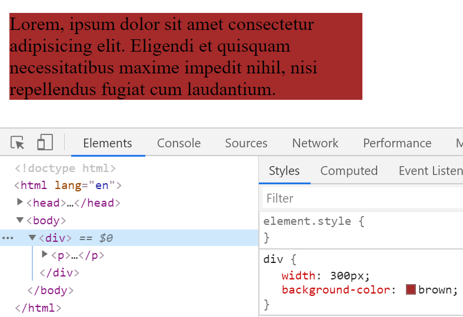
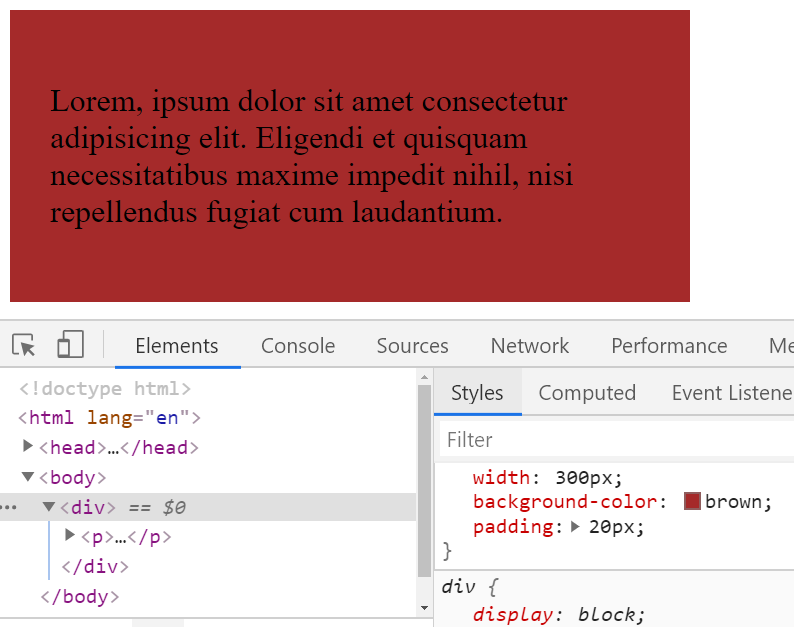
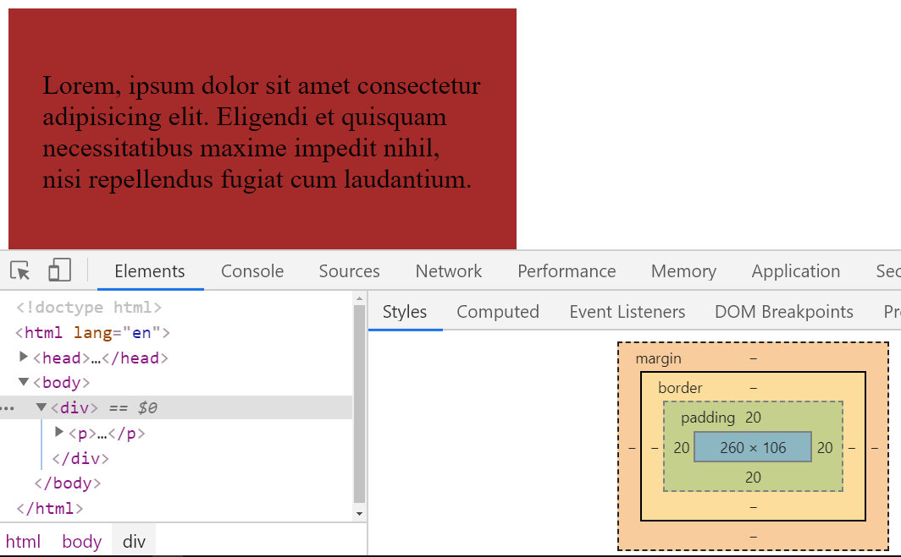

<div className="posts-wrapper">

Hey everyone. Welcome to JavaScriptWillRule. And this is another posts on my CSS playlists and this time its BoxSizing property.

# CSS | box-sizing Property

Many of you guys would have wondered on most of the tutorials on CSS would get started with code below:

```css
*, *::before, *::after {
  margin:0;
  padding:0;
  box-sizing:border-box;
}
```

Let's get started on why it's done like that:

CSS BoxSizing property defines how the element's width and height should be calculated, whether the total width of an element should contain padding and borders or inside the total width the padding and borders should contain.
As simple as that.

For a reminder, the box model looks like this:



Syntax:

```css
box-sizing: content-box|border-box;
```

As you can see from the syntax above, the CSS BoxSizing property accepts two values: Content Box and Border Box. Default box-sizing property is Content Box.

## <u>Content Box</u>

<br/>

As I said before, the default value for bix sizing property is Content Box. The width and height of the element only apply to the content of the element.

```html
<div>
  <p>Lorem, ipsum dolor sit amet consectetur adipisicing elit. Eligendi et quisquam necessitatibus maxime impedit nihil, nisi repellendus fugiat cum laudantium.</p>
</div>
```

<br/>

```css
* {
  box-sizing: content-box; /* default value, don't need to explicitly mention*/
}

div {
  width: 300px;
  background-color: brown;
}
```

Output:



So, you have declared 300px for that element and in the output it displayed as you thought. No issues. Now I am feeling that, the content inside the background/element is so congusted like a crowded bus. So just to give some room of space, I thought of adding some padding inside it.

```css
div {
  width: 300px;
  background-color: brown;
  padding:20px;
}
```

<br/>



Now it's not the same anymore, the width got elongated to 340px (300px + 20px left and right). To resolve this problem, border box property took over the job as head of everything.

## <u>Border Box</u>

<br/>

Let’s take the previous example. We specified the width of the element to be 300px, and the padding is 20px on each side. If you were to use content-box, then it’s becoming 340px.

Let's use border box property instead of content box property and see what is the difference.

```css
* {
  box-sizing: border-box;
}
```

<br/>



<br/>

As seen from the box model image above, it's clear that the total width is calculated like 260px + 20px (left and right) = 300px. As simple as that.

# Conclusion

There is a significant connection between the box-sizing property and the box model, and it is an important one. Also it is important to understand the difference to get into seamless workflow of developing websites to avoid confusions on width and height calculations. 

Happy coding! :)

</div>