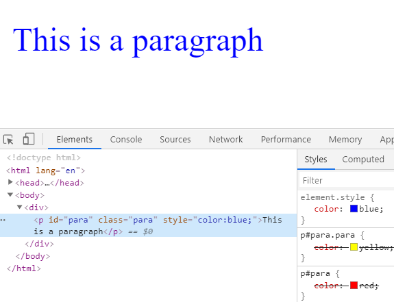
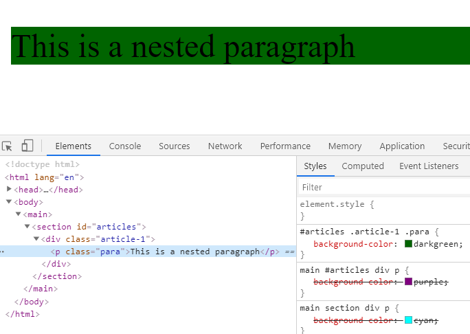

<div className="posts-wrapper">

CSS is pretty easy to get into, mainly due to the simple nature of its syntax. The most interesting part when working with CSS is, if an issue arises, the chances of finding the solution is so hard, that a solid understanding in CSS Specificity will break that barrier.

# <u>What is Specificity in CSS ?</u>

If you have two (or more) conflicting CSS rules that point to the same element, then the browser will assign the element with the more specific styles.  The rules the browser follows are collectively called _Specificity_.

# <u>How WebPage gets executed in browser ?</u>

Before going into the specificity rules, it's important to know the order in which the CSS stylesheets gets executed in a webpage.

Consider the below HTML code snippet:

```html
<html>
 <head>
  <link rel="stylesheets" href="styles.css"></link>
  <script src="./app.js" type="text/javascript"></script>
  <style>
    h2 {
      font-weight:bold;
    }
  </style>
 </head>
 <body>
    
 </body>
</html>
```

<br/>

Roughly the execution is as follows:

1. The HTML document gets downloaded and parsing starts

2. HTML parsing reaches _styles.css_ and gets downloaded.

3. Next, the _app.js_ gets downloaded either in background / asynchronously. In this case asynchronous.

4. Next, Internal CSS gets parsed

5. After the head is completed the body gets executed.

From the above step-by-step execution, it's clear that first the preference is given to InlineCSS (as the body gets executed at last) and then to internalCSS followed by External stylesheets.

```
InlineCSS > InternalCSS > ExternalStyles
```

Let's see with an example, where we will have a _p_ element that got styled in internalCSS, InlineCSS and ExternalCSS. Also we will be adding class and ID selectors to increase the specificity to just see if the above said precedence changes.

In _index.html_ (Internal and Inline CSS):

```html
<!DOCTYPE html>
<html lang="en">

<head>
  <meta charset="UTF-8">
  <meta name="viewport" content="width=device-width, initial-scale=1.0">
  <title>CSS Specificity</title>
  <link rel="stylesheet" href="styles.css">

  <style>
    p#para {
      color: red;
    }
  </style>
</head>

<body>
  <div>
    <p id="para" class="para" style="color:blue;">This is a paragraph</p>
  </div>
</body>

</html>
```

<br/>

In _styles.css_ (External CSS):

```css
p#para.para {
  color: yellow;
}
```

<br/>

### Output:



As you can see from the output image above, the inline CSS of color blue got applied to the paragraph element instead internal and external styles. The same has been displayed in the browser console with color yellow and red striked out.

If the inline CSS is removed, then the _color:red_ would be applied and after that external styles. 

## Back to the CSS Specificity on external Styles:

<br/>

As i said, the most specific selector gets to assign its property values to the HTML element. If the selectors are the same then the last one will always take precedence. For example,

```css
p {
  color:red;
}

p {
  color:blue;
}
```

In the above example, the font color for the paragraph will be BLUE, as the priority is given to the last one. However this is not the case if the selectors are different.

```html
<div>
  <p>This is a paragraph</p>
</div>
```
<br/>

```css
p#para {
  color:red;
}

p {
  color:blue;
}
```
<br/>

In the above case, as you are targeting the element p with ID selector (ID - has more specificity), color red will be assigned.

# <u>Calculating Specificity</u>

We will have specificity points assigned to selector and elements inorder to calculate which among the styles has higher specificity.

<div className="blockquote">

ID selector - 100 points

Class selector - 10 points

Element selector - 1 point

</div>

When you add them all up, you will arrive at a specificity value. Let's take an example:


```html
<main>
  <section id="articles">
    <div class="article-1">
      <p class="para">This is a nested paragraph</p>
    </div>
  </section>
</main>
```

<br/>

```css
main section div p {
  background-color: cyan;
}

main #articles div p {
  background-color: purple;
}

#articles .article-1 .para {
  background-color: darkgreen;
}
```
<br/>

### Output:

Let's order the specificity values for all the three CSS declarations:

```css
/* Specificity - 1 + 1 + 1 + 1 = 4 */

main section div p {
  background-color: cyan;
}

/* Specificity - 1 + 100 + 1 + 1 = 103 */

main #articles div p {
  background-color: purple;
}

/* Specificity - 100 + 10 + 10 = 120 */

#articles .article-1 .para {
  background-color: darkgreen;
}
```

<br/>

Background Color darkGreen will be applied because of higher specificity (120 points).




# Conclusion

Hope you guys understood well. Next time, if you have any issues with conflicting styles, don’t pull your hair out! Calm your nerves, remember the hierarchy of specificity that starts with inline styles given more preference followed by internal styles and external styles. Try those specificity calculation trick that i showed you, it will be useful.

And when writing CSS remember that you should only be as specific as you need to be, and not more. Enjoy what you are doing.

Happy coding! :)

</div>